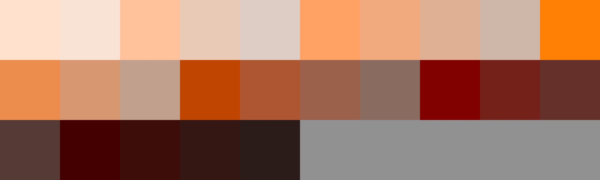
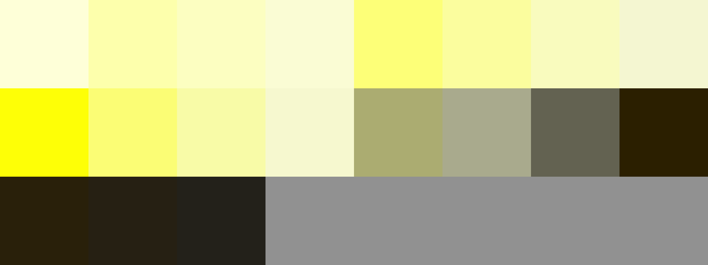

# Palettes

Click any image to go to the source image; the text line above the image to go to the source .hexplt file.

### [`01_Magentas`](01_Magentas.hexplt)

### [`02_MagentaRoses`](02_MagentaRoses.hexplt)

### [`03_Roses`](03_Roses.hexplt)

### [`04_RoseReds`](04_RoseReds.hexplt)

### [`05_Reds`](05_Reds.hexplt)

### [`06_4xRedOranges`](06_4xRedOranges.hexplt)

### [`07_3xRedOranges`](07_3xRedOranges.hexplt)

### [`08_2xRedOranges`](08_2xRedOranges.hexplt)

### [`09_DeepOranges`](09_DeepOranges.hexplt)

### [`10_Oranges`](10_Oranges.hexplt)

### [`11_2xOrangeYellows`](11_2xOrangeYellows.hexplt)

### [`12_OrangeYellows`](12_OrangeYellows.hexplt)

### [`13_Yellows`](13_Yellows.hexplt)

### [`14_2xYellowGreens`](14_2xYellowGreens.hexplt)

### [`15_YellowGreens`](15_YellowGreens.hexplt)

### [`16_Greens`](16_Greens.hexplt)

### [`17_DeeperGreens`](17_DeeperGreens.hexplt)

### [`18_TurquoiseGreens`](18_TurquoiseGreens.hexplt)

### [`19_Turquoises`](19_Turquoises.hexplt)

### [`20_TurquoiseCyans`](20_TurquoiseCyans.hexplt)

### [`21_Cyans`](21_Cyans.hexplt)

### [`22_CyanBlues`](22_CyanBlues.hexplt)

### [`23_SkyBlues`](23_SkyBlues.hexplt)

### [`24_DeeperSkyBlues`](24_DeeperSkyBlues.hexplt)

### [`25_Ultramarines`](25_Ultramarines.hexplt)

### [`26_2xUltramarineViolets`](26_2xUltramarineViolets.hexplt)

### [`27_UltramarineViolets`](27_UltramarineViolets.hexplt)

### [`28_Violets`](28_Violets.hexplt)

### [`29_4xVioletMagentas`](29_4xVioletMagentas.hexplt)

### [`30_3xVioletMagentas`](30_3xVioletMagentas.hexplt)

### [`31_2xVioletMagentas`](31_2xVioletMagentas.hexplt)

### [`32_VioletMagentas`](32_VioletMagentas.hexplt)

Created with [palettesMarkdownGallery.sh](https://github.com/earthbound19/_ebDev/blob/master/scripts/palettesMarkdownGallery.sh).