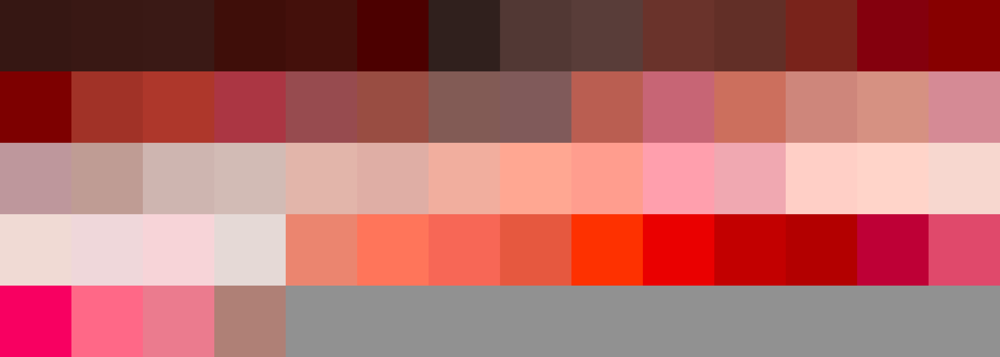
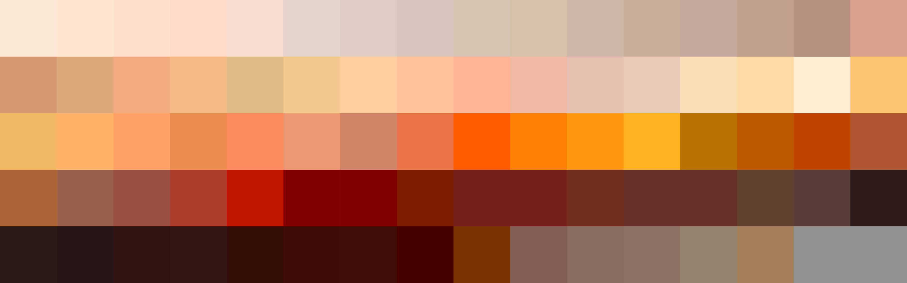
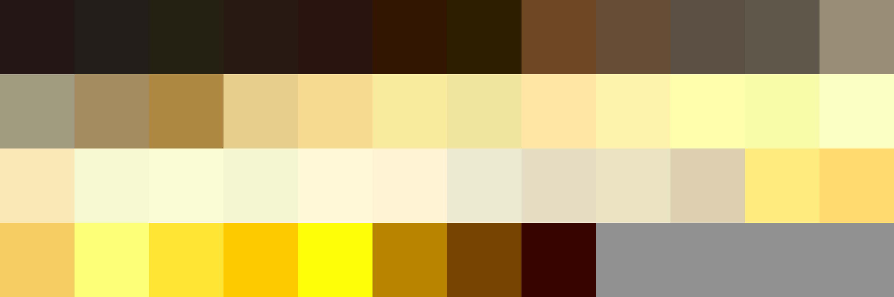

# Palettes

Click any image to go to the source image; the text line above the image to go to the source .hexplt file.

### [`01_Magenta_Roses_to_Roses`](01_Magenta_Roses_to_Roses.hexplt)

### [`02_Rose_Reds_to_Reds_to_Red_Oranges`](02_Rose_Reds_to_Reds_to_Red_Oranges.hexplt)

### [`03_Red_Oranges_to_Deep_Oranges_to_Oranges`](03_Red_Oranges_to_Deep_Oranges_to_Oranges.hexplt)

### [`04_Orange_Yellows_to_Yellows`](04_Orange_Yellows_to_Yellows.hexplt)

### [`05_Yellow_Greens_to_Greens_to_Deeper_Greens`](05_Yellow_Greens_to_Greens_to_Deeper_Greens.hexplt)

### [`06_Turquoise_Greens_to_Turquoises_to_Turquoise_Cyans`](06_Turquoise_Greens_to_Turquoises_to_Turquoise_Cyans.hexplt)

### [`07_Turquoise_Cyans_to_Cyans_to_Cyan_Blues`](07_Turquoise_Cyans_to_Cyans_to_Cyan_Blues.hexplt)

### [`08_Blues`](08_Blues.hexplt)

### [`09_Ultramarines_to_Ultramarine_Violets`](09_Ultramarines_to_Ultramarine_Violets.hexplt)

### [`10_Violets_to_3x_Violet_Magentas`](10_Violets_to_3x_Violet_Magentas.hexplt)

### [`11_2x_Violet_Magentas_to_Magentas`](11_2x_Violet_Magentas_to_Magentas.hexplt)

Created with [palettesMarkdownGallery.sh](https://github.com/earthbound19/_ebDev/blob/master/scripts/imgAndVideo/palettesMarkdownGallery.sh).