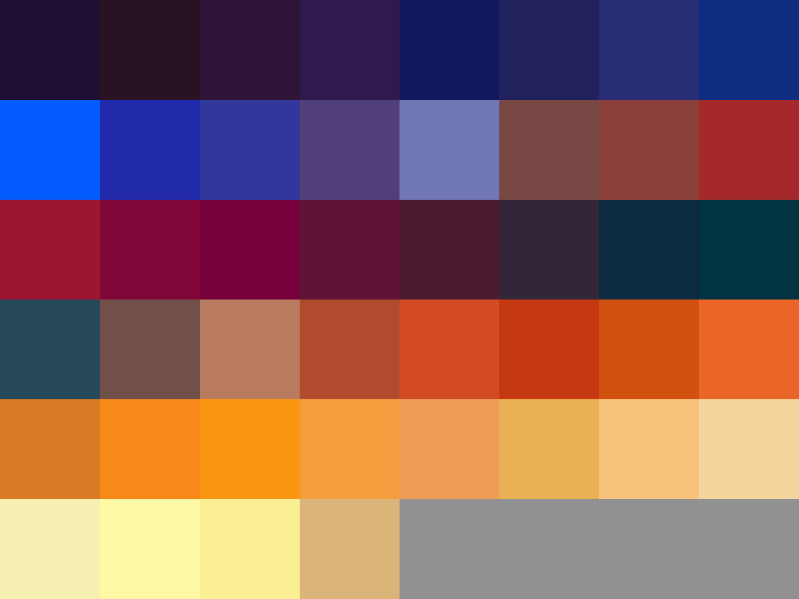

# Palettes

Click any image to go to the source image; the text line above the image to go to the source .hexplt file.

### [`Blue_Fire`](Blue_Fire.hexplt)

### [`Blue_Fire_4`](Blue_Fire_4.hexplt)

### [`Blue_Fire_5`](Blue_Fire_5.hexplt)

### [`Blue_Fire_extended`](Blue_Fire_extended.hexplt)

### [`blue_fire_1`](blue_fire_1.hexplt)

### [`blue_fire_2`](blue_fire_2.hexplt)

### [`blue_fire_3`](blue_fire_3.hexplt)

Created with [palettesMarkdownGallery.sh](https://github.com/earthbound19/_ebDev/blob/master/scripts/imgAndVideo/palettesMarkdownGallery.sh).