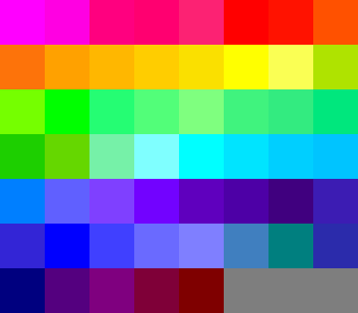
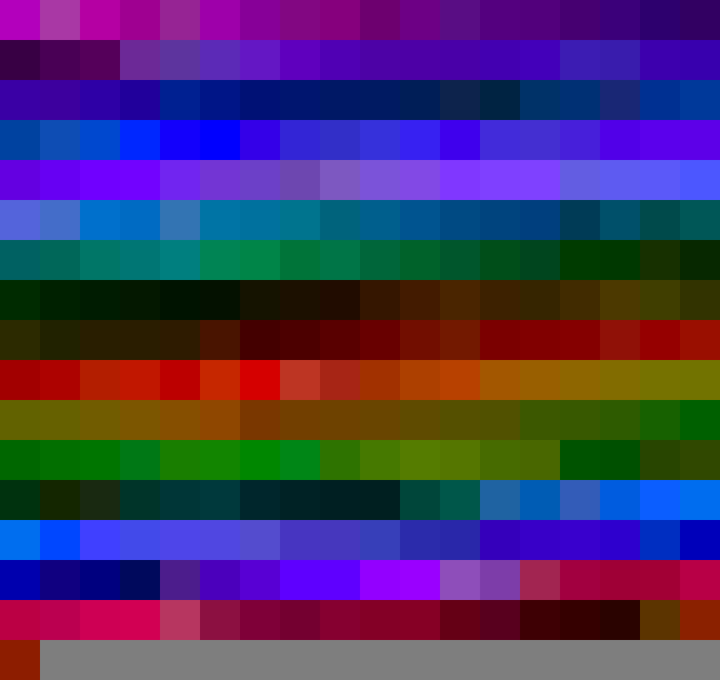
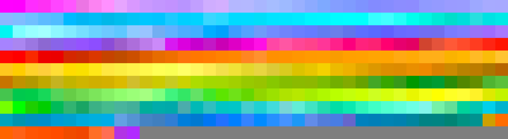
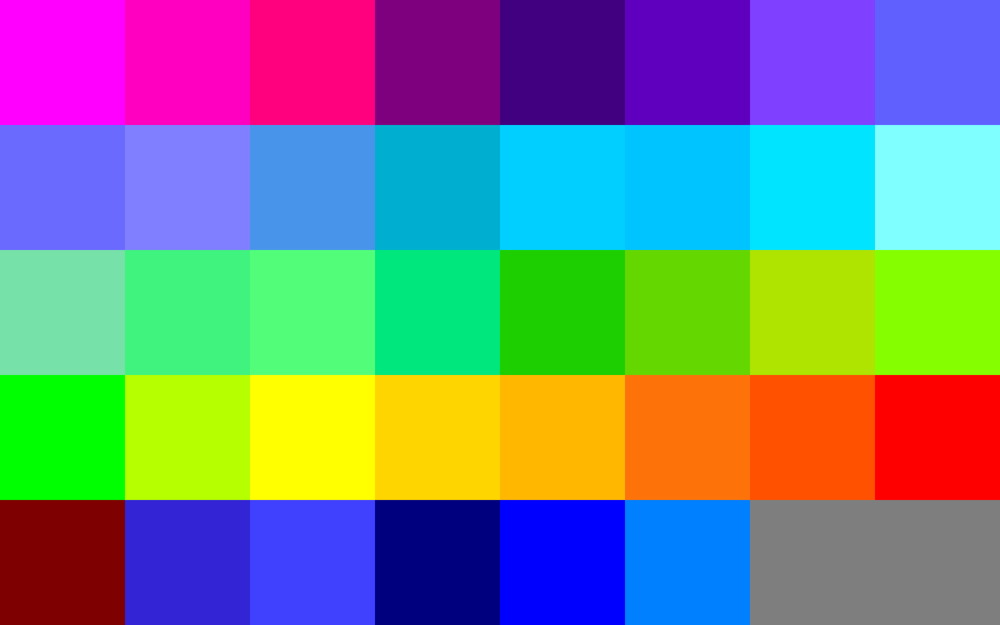
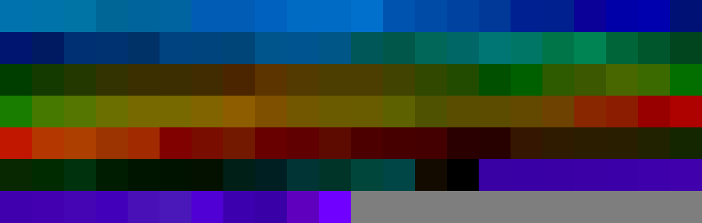
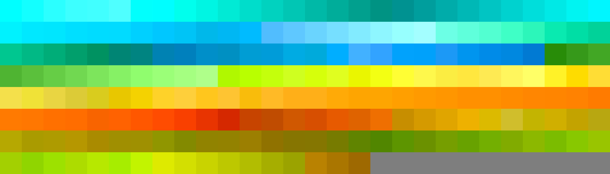
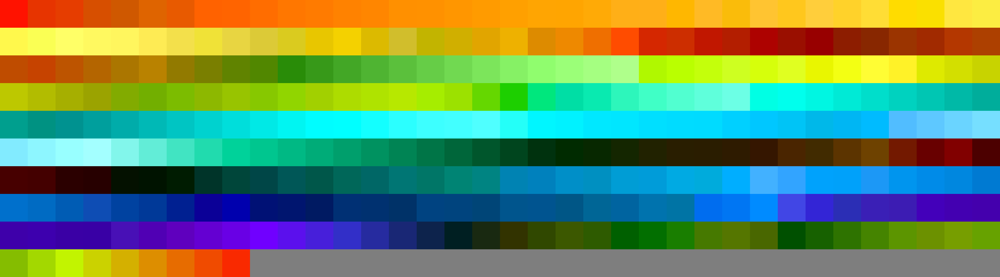
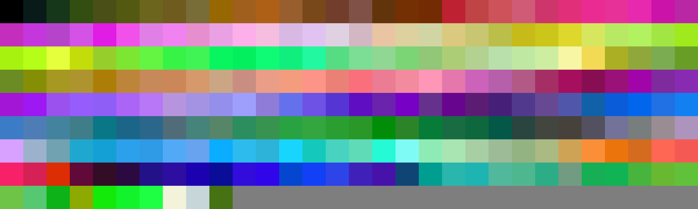
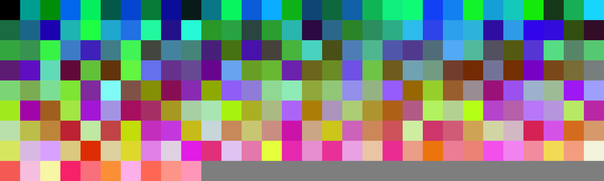
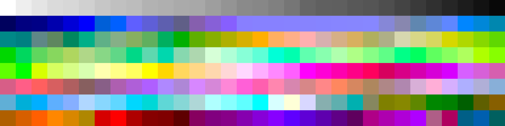

# Palettes

Click any image to go to the source image; the text line above the image to go to the source .hexplt file.

### [abstractBrowserAddon](abstractBrowserAddon.hexplt)

### [collectedColors1](collectedColors1.hexplt)

### [ColorSchemeHexBurntSandstone](ColorSchemeHexBurntSandstone.hexplt)

### [ColorSchemeHexBurntSandstoneNarrower](ColorSchemeHexBurntSandstoneNarrower.hexplt)

### [colour_12_wheel](colour_12_wheel.hexplt)

### [commodore_vic](commodore_vic.hexplt)

### [cyanOceanicWithDirty](cyanOceanicWithDirty.hexplt)

### [cyansForShimmering](cyansForShimmering.hexplt)

### [cyansForShimmeringSubtle](cyansForShimmeringSubtle.hexplt)

### [dark_fire_growth_water_light](dark_fire_growth_water_light.hexplt)

### [darkBG](darkBG.hexplt)

### [datavis0001](datavis0001.hexplt)

### [fiveGrays](fiveGrays.hexplt)

### [fundamental_vivid_hues](fundamental_vivid_hues.hexplt)

### [fundamental_vivid_hues_darks](fundamental_vivid_hues_darks.hexplt)

### [fundamental_vivid_hues_lights](fundamental_vivid_hues_lights.hexplt)

### [fundamental_vivid_hues_lights_mod](fundamental_vivid_hues_lights_mod.hexplt)

### [fundamental_vivid_hues_v2](fundamental_vivid_hues_v2.hexplt)

### [LakeBonnevileDesertHexColors](LakeBonnevileDesertHexColors.hexplt)

### [markerLikeBackgroundColors](markerLikeBackgroundColors.hexplt)

### [markerLikeColorsDarks](markerLikeColorsDarks.hexplt)

### [markerLikeColorsDarksAndLightsLooped](markerLikeColorsDarksAndLightsLooped.hexplt)

### [markerLikeColorsDarksLighterDuller](markerLikeColorsDarksLighterDuller.hexplt)

### [markerLikeColorsLights](markerLikeColorsLights.hexplt)

### [near_to_far_vivid](near_to_far_vivid.hexplt)

### [PrismacolorMarkers_CIECAM02_sort](PrismacolorMarkers_CIECAM02_sort.hexplt)

### [PrismacolorMarkers_RND_sort](PrismacolorMarkers_RND_sort.hexplt)

### [PrismacolorMarkersDarksNextNearestSort](PrismacolorMarkersDarksNextNearestSort.hexplt)

### [PrismacolorMarkersLightsNextNearestSort](PrismacolorMarkersLightsNextNearestSort.hexplt)

### [RAHfavoriteColorsHex](RAHfavoriteColorsHex.hexplt)

### [rainbowHexColorsByMyEye](rainbowHexColorsByMyEye.hexplt)

### [rainbowHexColorsByMyEyeDarkShades](rainbowHexColorsByMyEyeDarkShades.hexplt)

### [rainbowHexColorsByMyEyeLightShades](rainbowHexColorsByMyEyeLightShades.hexplt)

### [rainbowHexColorsByMyEyeManyShadesLoop](rainbowHexColorsByMyEyeManyShadesLoop.hexplt)

### [rainbowHexColorsTooSimpleTooDark](rainbowHexColorsTooSimpleTooDark.hexplt)

### [recreated_palette_00001_narmth](recreated_palette_00001_narmth.hexplt)

### [RGB_combos_of_255_127_and_0_repetition_allowed](RGB_combos_of_255_127_and_0_repetition_allowed.hexplt)

### [RWB_hexColors](RWB_hexColors.hexplt)

### [shadesOfBrownHexColors](shadesOfBrownHexColors.hexplt)

### [sparkleHeartHexColors](sparkleHeartHexColors.hexplt)

### [tigerDogRabbit_13shadesEach](tigerDogRabbit_13shadesEach.hexplt)

### [tigerDogRabbit_HexColors](tigerDogRabbit_HexColors.hexplt)

### [turtleGreenTetradicEtcHex](turtleGreenTetradicEtcHex.hexplt)

### [10shadesOfGrayCIECAM02](10shadesOfGrayCIECAM02.hexplt)

### [12_MaxChroma_hues_fromCIECAM02](12_MaxChroma_hues_fromCIECAM02.hexplt)

### [16_MaxChroma_hues](16_MaxChroma_hues.hexplt)

### [18shadesOfGrayCIECAM02](18shadesOfGrayCIECAM02.hexplt)

### [250_MMpMwpZQ_HexColors_CIECAM02_sorted](250_MMpMwpZQ_HexColors_CIECAM02_sorted.hexplt)

### [250_MMpMwpZQ_HexColors_HEX_RNDsort](250_MMpMwpZQ_HexColors_HEX_RNDsort.hexplt)

### [256terminalColorsHEX](256terminalColorsHEX.hexplt)

### [517_converted_from_Lab_simplified](517_converted_from_Lab_simplified.hexplt)

### [551_converted_from_HSL_simplified](551_converted_from_HSL_simplified.hexplt)

Created with [palettesMarkdownGallery.sh](https://github.com/earthbound19/_ebDev/blob/master/scripts/palettesMarkdownGallery.sh).