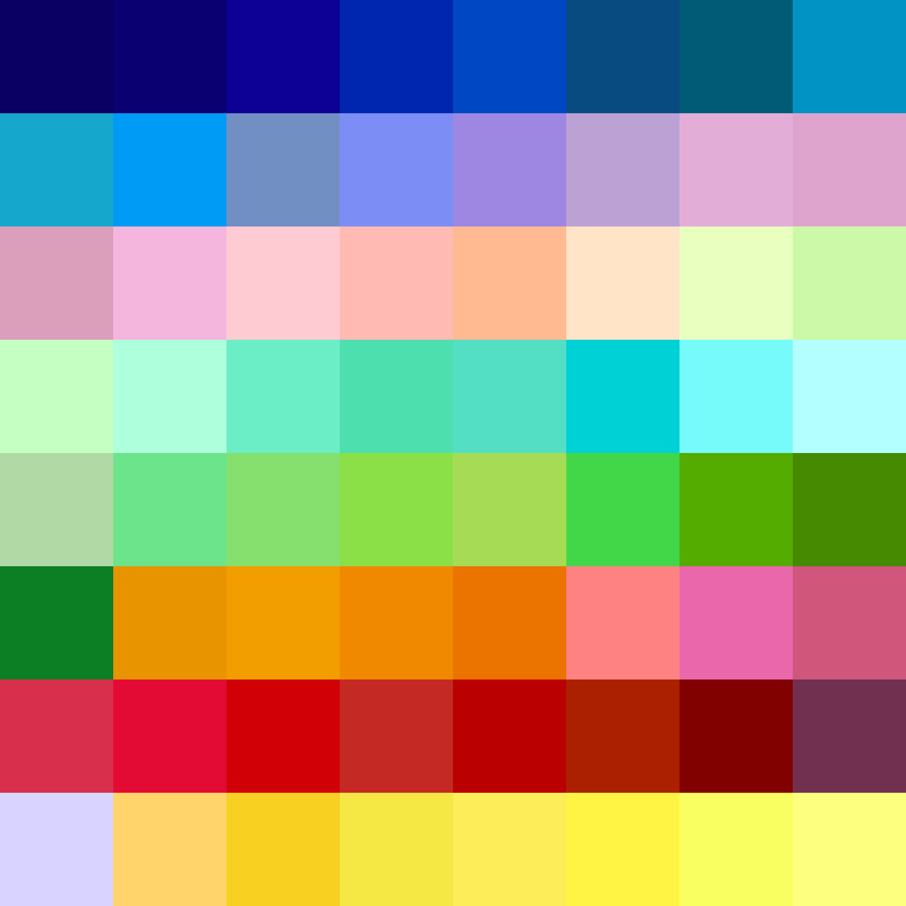
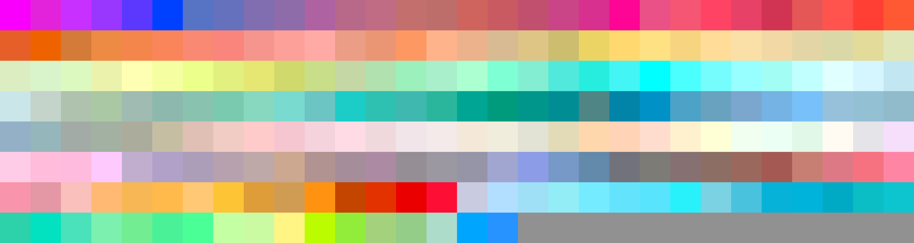

# Palettes

Click any image to go to the source image; the text line above the image to go to the source .hexplt file.

### [`Adobe_Swatch_Pure_16`](Adobe_Swatch_Pure_16.hexplt)

### [`Banana_Split`](Banana_Split.hexplt)

### [`Barbenheimer`](Barbenheimer.hexplt)

### [`Barbie`](Barbie.hexplt)

### [`Boba_Fett_Armor`](Boba_Fett_Armor.hexplt)

### [`Boba_Fett_More_More_Cyans`](Boba_Fett_More_More_Cyans.hexplt)

### [`Burnt_Sandstone`](Burnt_Sandstone.hexplt)

### [`Burnt_Sandstone_Extended`](Burnt_Sandstone_Extended.hexplt)

### [`Burnt_Sandstone_and_Firebird_B`](Burnt_Sandstone_and_Firebird_B.hexplt)

### [`Burnt_Sandstone_and_Firebird_B_and_E_Abridged`](Burnt_Sandstone_and_Firebird_B_and_E_Abridged.hexplt)

### [`Butter_and_Light_Jade`](Butter_and_Light_Jade.hexplt)

### [`Collected_01`](Collected_01.hexplt)

### [`Commodore_VIC`](Commodore_VIC.hexplt)

### [`Cool_Cats`](Cool_Cats.hexplt)

### [`Cool_Cats_Terraformed_Faux_Oatmeal`](Cool_Cats_Terraformed_Faux_Oatmeal.hexplt)

### [`Craft_Paper_00001`](Craft_Paper_00001.hexplt)

### [`Craft_Paper_00002`](Craft_Paper_00002.hexplt)

### [`Craft_Paper_00004`](Craft_Paper_00004.hexplt)

### [`Craft_Paper_00005`](Craft_Paper_00005.hexplt)

### [`Craft_Paper_00006`](Craft_Paper_00006.hexplt)

### [`Craft_Paper_00007`](Craft_Paper_00007.hexplt)

### [`Craft_Paper_00013`](Craft_Paper_00013.hexplt)

### [`Craft_Paper_00015`](Craft_Paper_00015.hexplt)

### [`Craft_Paper_00017`](Craft_Paper_00017.hexplt)

### [`Craft_Paper_00018`](Craft_Paper_00018.hexplt)

### [`Craft_Paper_00019`](Craft_Paper_00019.hexplt)

### [`Craft_Paper_00020`](Craft_Paper_00020.hexplt)

### [`Craft_Paper_00021`](Craft_Paper_00021.hexplt)

### [`Craft_Paper_00022`](Craft_Paper_00022.hexplt)

### [`Craft_Paper_00023`](Craft_Paper_00023.hexplt)

### [`Craft_Paper_00024`](Craft_Paper_00024.hexplt)

### [`Craft_Paper_00026`](Craft_Paper_00026.hexplt)

### [`Craft_Paper_00027`](Craft_Paper_00027.hexplt)

### [`Craft_Paper_00028`](Craft_Paper_00028.hexplt)

### [`Craft_Paper_00029`](Craft_Paper_00029.hexplt)

### [`Craft_Paper_00030`](Craft_Paper_00030.hexplt)

### [`Craft_Paper_00031`](Craft_Paper_00031.hexplt)

### [`Craft_Paper_00032`](Craft_Paper_00032.hexplt)

### [`Craft_Paper_00034`](Craft_Paper_00034.hexplt)

### [`Craft_Paper_00035`](Craft_Paper_00035.hexplt)

### [`Craft_Paper_00036`](Craft_Paper_00036.hexplt)

### [`Craft_Paper_00037`](Craft_Paper_00037.hexplt)

### [`Craft_Paper_00038`](Craft_Paper_00038.hexplt)

### [`Craft_Paper_00039`](Craft_Paper_00039.hexplt)

### [`Craft_Paper_00040`](Craft_Paper_00040.hexplt)

### [`Craft_Paper_00041`](Craft_Paper_00041.hexplt)

### [`Craft_Paper_00042`](Craft_Paper_00042.hexplt)

### [`Craft_Paper_00043`](Craft_Paper_00043.hexplt)

### [`Craft_Paper_00044`](Craft_Paper_00044.hexplt)

### [`Cyan_Oceanic`](Cyan_Oceanic.hexplt)

### [`Cyan_to_Chocolate_7-Gradient`](Cyan_to_Chocolate_7-Gradient.hexplt)

### [`Cyans_for_Shimmering`](Cyans_for_Shimmering.hexplt)

### [`Cyans_for_Shimmering_Subtle`](Cyans_for_Shimmering_Subtle.hexplt)

### [`Dark_Wizard`](Dark_Wizard.hexplt)

### [`Datavis_0001`](Datavis_0001.hexplt)

### [`Dead_Maple`](Dead_Maple.hexplt)

### [`Dead_Maple_Extended`](Dead_Maple_Extended.hexplt)

### [`Deep_Ultramarines_AC`](Deep_Ultramarines_AC.hexplt)

### [`Din_Djarin_Armor`](Din_Djarin_Armor.hexplt)

### [`EB_Favorites_v1`](EB_Favorites_v1.hexplt)

### [`EB_Favorites_v2`](EB_Favorites_v2.hexplt)

### [`EB_Favorites_v2_Alt`](EB_Favorites_v2_Alt.hexplt)

### [`EB_Favorites_v2_Alt_Very_Dark_Alts`](EB_Favorites_v2_Alt_Very_Dark_Alts.hexplt)

### [`Elements_and_Tea`](Elements_and_Tea.hexplt)

### [`Faded_Tyre`](Faded_Tyre.hexplt)

### [`Faded_Tyre_6_Hues`](Faded_Tyre_6_Hues.hexplt)

### [`Faux_Oatmeal`](Faux_Oatmeal.hexplt)

### [`Fire_on_The_Water`](Fire_on_The_Water.hexplt)

### [`Firebird_B`](Firebird_B.hexplt)

### [`Floral_00001`](Floral_00001.hexplt)

### [`Floral_00002`](Floral_00002.hexplt)

### [`Floral_00003`](Floral_00003.hexplt)

### [`Floral_00004`](Floral_00004.hexplt)

### [`Floral_00005`](Floral_00005.hexplt)

### [`Floral_00006`](Floral_00006.hexplt)

### [`Floral_00008`](Floral_00008.hexplt)

### [`Hobby_Art_0001-0003`](Hobby_Art_0001-0003.hexplt)

### [`Humanae`](Humanae.hexplt)

### [`Huntington_Library_Botanical_Garden_01`](Huntington_Library_Botanical_Garden_01.hexplt)

### [`Integration_5-Hues`](Integration_5-Hues.hexplt)

### [`Integration_9-Hues`](Integration_9-Hues.hexplt)

### [`Juniper_Bark_and_Desert_Soil`](Juniper_Bark_and_Desert_Soil.hexplt)

### [`Lake_Bonneville_Desert`](Lake_Bonneville_Desert.hexplt)

### [`Light_Lively_Moss_to_Buttery_Orange_Yellow`](Light_Lively_Moss_to_Buttery_Orange_Yellow.hexplt)

### [`Light_and_Dusty_Jades`](Light_and_Dusty_Jades.hexplt)

### [`Lively_Moss_and_Buttery_Orange_Yellow`](Lively_Moss_and_Buttery_Orange_Yellow.hexplt)

### [`Lively_Moss_to_Buttery_Orange-Yellow_2`](Lively_Moss_to_Buttery_Orange-Yellow_2.hexplt)

### [`Magenta_Rose_Zinnia`](Magenta_Rose_Zinnia.hexplt)

### [`Magenta_Rose_Zinnia_Deadhead`](Magenta_Rose_Zinnia_Deadhead.hexplt)

### [`Marker-Like_BG`](Marker-Like_BG.hexplt)

### [`Marker-Like_Darks_and_Lights_Looped`](Marker-Like_Darks_and_Lights_Looped.hexplt)

### [`Marker-Like_Lights_mod`](Marker-Like_Lights_mod.hexplt)

### [`Marker-Like_Lights_mod_HCT_sort`](Marker-Like_Lights_mod_HCT_sort.hexplt)

### [`Nasturtium`](Nasturtium.hexplt)

### [`Old_3D_Glasses`](Old_3D_Glasses.hexplt)

### [`Oppenheimer`](Oppenheimer.hexplt)

### [`Organic_Byproduct_Dyes`](Organic_Byproduct_Dyes.hexplt)

### [`Pantone_2015_Womens_Spring_More_Vivid`](Pantone_2015_Womens_Spring_More_Vivid.hexplt)

### [`Pantone_2015_Womens_Spring_More_Vivid_Alt`](Pantone_2015_Womens_Spring_More_Vivid_Alt.hexplt)

### [`Pantone_2015_Womens_Spring_Vivid_Pair`](Pantone_2015_Womens_Spring_Vivid_Pair.hexplt)

### [`Paradise`](Paradise.hexplt)

### [`Perplexing_001`](Perplexing_001.hexplt)

### [`Plant_Mage`](Plant_Mage.hexplt)

### [`Prismacolor_Markers`](Prismacolor_Markers.hexplt)

### [`RGB_Combos_of_255_127_and_0_Repetition_Allowed`](RGB_Combos_of_255_127_and_0_Repetition_Allowed.hexplt)

### [`Recreated_00001_Narmth`](Recreated_00001_Narmth.hexplt)

### [`Red_White_and_Blue`](Red_White_and_Blue.hexplt)

### [`Rusty_Vintage_Vehicle`](Rusty_Vintage_Vehicle.hexplt)

### [`Rusty_Vintage_Vehicle_v2_`](Rusty_Vintage_Vehicle_v2_.hexplt)

### [`Rusty_Vintage_Vehicle_v2_b_64_Colors`](Rusty_Vintage_Vehicle_v2_b_64_Colors.hexplt)

### [`Shades_of_Brown`](Shades_of_Brown.hexplt)

### [`Shades_of_Cyan`](Shades_of_Cyan.hexplt)

### [`Sipee`](Sipee.hexplt)

### [`Smeared_Cherry_Plum`](Smeared_Cherry_Plum.hexplt)

### [`Soil_Pigments`](Soil_Pigments.hexplt)

### [`Soil_Pigments_Accents`](Soil_Pigments_Accents.hexplt)

### [`Soil_Pigments_Accents_and_32_Max_Chroma_Tweak`](Soil_Pigments_Accents_and_32_Max_Chroma_Tweak.hexplt)

### [`Soil_Pigments_Darker`](Soil_Pigments_Darker.hexplt)

### [`Soil_Pigments_Darker_and_Dark_Backgrounds_Tweak`](Soil_Pigments_Darker_and_Dark_Backgrounds_Tweak.hexplt)

### [`Soil_Pigments_Tweaked_Accented_01`](Soil_Pigments_Tweaked_Accented_01.hexplt)

### [`Sparkle_Heart`](Sparkle_Heart.hexplt)

### [`Stickers_00001`](Stickers_00001.hexplt)

### [`Still_Life_Apron`](Still_Life_Apron.hexplt)

### [`Subset_of_Collections_01-03_for_Art_Projects`](Subset_of_Collections_01-03_for_Art_Projects.hexplt)

### [`Summer_of_Vampires`](Summer_of_Vampires.hexplt)

### [`Sunburn`](Sunburn.hexplt)

### [`Sunflower`](Sunflower.hexplt)

### [`Sunset_01`](Sunset_01.hexplt)

### [`Terraformed`](Terraformed.hexplt)

### [`The_Mystic`](The_Mystic.hexplt)

### [`Tiger_Dog_Rabbit`](Tiger_Dog_Rabbit.hexplt)

### [`Turtle_Green_Tetradic_etc`](Turtle_Green_Tetradic_etc.hexplt)

### [`Tyre`](Tyre.hexplt)

### [`USA_Soil`](USA_Soil.hexplt)

### [`Watercolor_Pigments`](Watercolor_Pigments.hexplt)

### [`Winter_Sunrise_260ft`](Winter_Sunrise_260ft.hexplt)

### [`Winter_Sunrise_4500ft`](Winter_Sunrise_4500ft.hexplt)

### [`Yum_2`](Yum_2.hexplt)

### [`12_Wheel`](12_Wheel.hexplt)

### [`16_Max_Chroma_Medium_Light`](16_Max_Chroma_Medium_Light.hexplt)

### [`16_Max_Chroma_Medium_Light_More_Lively_Greens`](16_Max_Chroma_Medium_Light_More_Lively_Greens.hexplt)

### [`32_Max_Chroma_Medium_Light`](32_Max_Chroma_Medium_Light.hexplt)

### [`32_Max_Chroma_Medium_Light_More_Lively_Greens`](32_Max_Chroma_Medium_Light_More_Lively_Greens.hexplt)

### [`50s_Machine_Shop`](50s_Machine_Shop.hexplt)

### [`50s_Machine_Shop_Extended`](50s_Machine_Shop_Extended.hexplt)

### [`256_Terminal`](256_Terminal.hexplt)

Created with [palettesMarkdownGallery.sh](https://github.com/earthbound19/_ebDev/blob/master/scripts/imgAndVideo/palettesMarkdownGallery.sh).