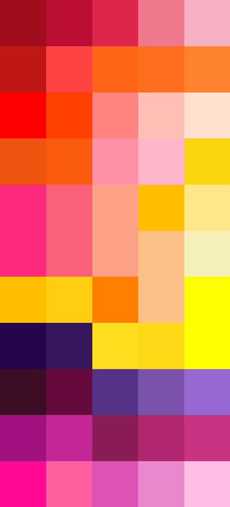

# Palettes

Click any image to go to the source image; the text line above the image to go to the source .hexplt file.

### [`Orange_Flower_and_Rose_to_Yellow_Yellow_Orange_Flower_Augmented_1_Grid`](Orange_Flower_and_Rose_to_Yellow_Yellow_Orange_Flower_Augmented_1_Grid.hexplt)

### [`Rose_and_Red_Flowers_Augmented_5_Grid`](Rose_and_Red_Flowers_Augmented_5_Grid.hexplt)

### [`Rose_and_Red_Flowers_Augmented_5_Grid_v2`](Rose_and_Red_Flowers_Augmented_5_Grid_v2.hexplt)

### [`Rose_and_Red_Flowers_PalettesColumnsOklabSortGrid_n8_S000000_v2`](Rose_and_Red_Flowers_PalettesColumnsOklabSortGrid_n8_S000000_v2.hexplt)

### [`Rose_and_Red_Flowers_Palettes_Grid_v2`](Rose_and_Red_Flowers_Palettes_Grid_v2.hexplt)

### [`Rose_and_Red_Flowers_Palettes_Grid_v3_Alt_No_Duplicate_Rose_to_Yellow`](Rose_and_Red_Flowers_Palettes_Grid_v3_Alt_No_Duplicate_Rose_to_Yellow.hexplt)

Created with [palettesMarkdownGallery.sh](https://github.com/earthbound19/_ebDev/blob/master/scripts/imgAndVideo/palettesMarkdownGallery.sh).