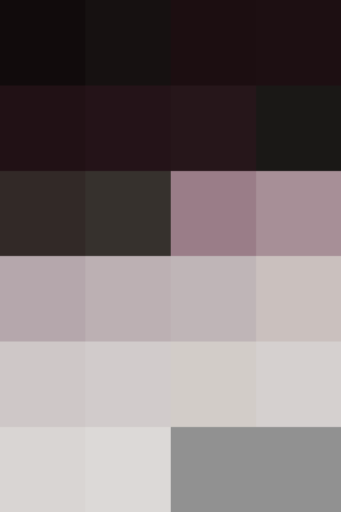

# Palettes

Click any image to go to the source image; the text line above the image to go to the source .hexplt file.

### [`Wool_Unfaded_to_Tyrian_Purple_BG`](Wool_Unfaded_to_Tyrian_Purple_BG.hexplt)

Created with [palettesMarkdownGallery.sh](https://github.com/earthbound19/_ebDev/blob/master/scripts/imgAndVideo/palettesMarkdownGallery.sh).