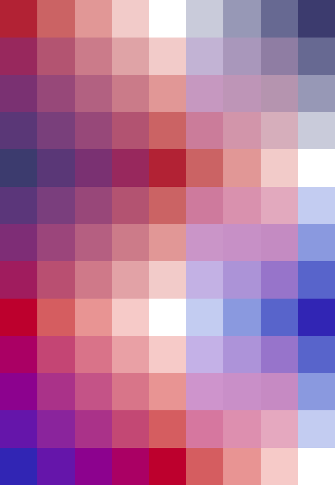

# Palettes

Click any image to go to the source image; the text line above the image to go to the source .hexplt file.

### [`Barbenheimer-3-select-A`](Barbenheimer-3-select-A.hexplt)

### [`Barbenheimer-3-select-B`](Barbenheimer-3-select-B.hexplt)

### [`Barbenheimer-3-select_augmented-3x7-grid`](Barbenheimer-3-select_augmented-3x7-grid.hexplt)

### [`The_Plant_Mage_and_The_Mystic_Augmented_Grid`](The_Plant_Mage_and_The_Mystic_Augmented_Grid.hexplt)

### [`oklch-3x3-Old_Glory_and_More_Vibrant_alt_arrangement_Augmented-grid`](oklch-3x3-Old_Glory_and_More_Vibrant_alt_arrangement_Augmented-grid.hexplt)

### [`oklch-3x3-from_4_arranged_Old_Glory_and_More_Vibrant_Augmented-grid`](oklch-3x3-from_4_arranged_Old_Glory_and_More_Vibrant_Augmented-grid.hexplt)

Created with [palettesMarkdownGallery.sh](https://github.com/earthbound19/_ebDev/blob/master/scripts/imgAndVideo/palettesMarkdownGallery.sh).