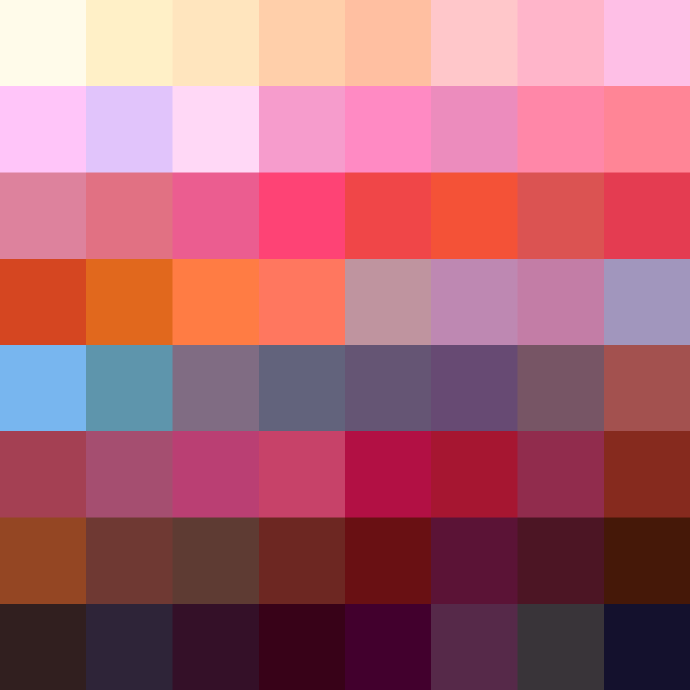

# Palettes

Click any image to go to the source image; the text line above the image to go to the source .hexplt file.

### [`cherry_plum_tree_bloom_reduced_01`](cherry_plum_tree_bloom_reduced_01.hexplt)

### [`cherry_plum_tree_bloom_reduced_02`](cherry_plum_tree_bloom_reduced_02.hexplt)

### [`cherry_plum_tree_bloom_reduced_03_impression`](cherry_plum_tree_bloom_reduced_03_impression.hexplt)

Created with [palettesMarkdownGallery.sh](https://github.com/earthbound19/_ebDev/blob/master/scripts/imgAndVideo/palettesMarkdownGallery.sh).