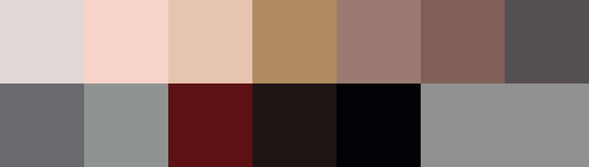

# Palettes

Click any image to go to the source image; the text line above the image to go to the source .hexplt file.

### [`Nail_Polish_Collection_neutrals_and_browns`](Nail_Polish_Collection_neutrals_and_browns.hexplt)

Created with [palettesMarkdownGallery.sh](https://github.com/earthbound19/_ebDev/blob/master/scripts/imgAndVideo/palettesMarkdownGallery.sh).