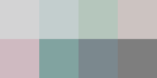

# Palettes

Click any image to go to the source image; the text line above the image to go to the source .hexplt file.

### [Pantone_2015_womens_spring_colors_more_vivid_masculineHEX_mod](Pantone_2015_womens_spring_colors_more_vivid_masculineHEX_mod.hexplt)

### [Pantone_2015_womens_spring_colors_more_vivid_neuterHEX](Pantone_2015_womens_spring_colors_more_vivid_neuterHEX.hexplt)

### [Pantone_2015_womens_spring_colors_retroClassicVariantsHEX](Pantone_2015_womens_spring_colors_retroClassicVariantsHEX.hexplt)

### [Pantone_2015_womens_spring_colors_retroClassicVariantsInvertHEX](Pantone_2015_womens_spring_colors_retroClassicVariantsInvertHEX.hexplt)

### [Pantone_2015_womens_spring_colors_retroHazyVariantsHEX](Pantone_2015_womens_spring_colors_retroHazyVariantsHEX.hexplt)

### [Pantone_2015_womens_spring_colors_twoVeryVividVariantsHEX](Pantone_2015_womens_spring_colors_twoVeryVividVariantsHEX.hexplt)

### [Pantone_2015_womens_spring_colorsHEX](Pantone_2015_womens_spring_colorsHEX.hexplt)

Created with [palettesMarkdownGallery.sh](https://github.com/earthbound19/_ebDev/blob/master/scripts/palettesMarkdownGallery.sh).