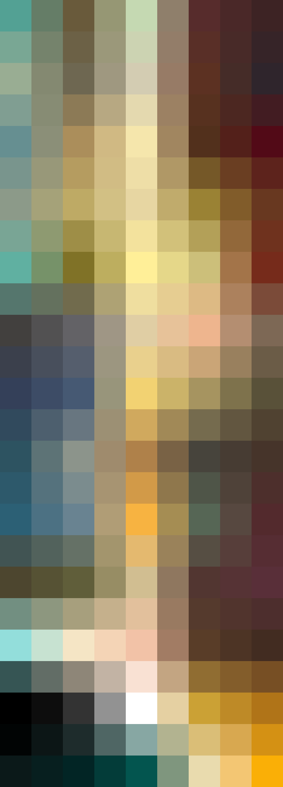

# Palettes

Click any image to go to the source image; the text line above the image to go to the source .hexplt file.

### [`This_Is_The_Way_Augmented-1-grid`](This_Is_The_Way_Augmented-1-grid.hexplt)

### [`This_Is_The_Way_Augmented-2-grid`](This_Is_The_Way_Augmented-2-grid.hexplt)

### [`This_Is_The_Way_PalettesColumnsOklabSortGrid_n8_S000000`](This_Is_The_Way_PalettesColumnsOklabSortGrid_n8_S000000.hexplt)

### [`This_Is_The_Way_Palettes_Grid`](This_Is_The_Way_Palettes_Grid.hexplt)

Created with [palettesMarkdownGallery.sh](https://github.com/earthbound19/_ebDev/blob/master/scripts/imgAndVideo/palettesMarkdownGallery.sh).