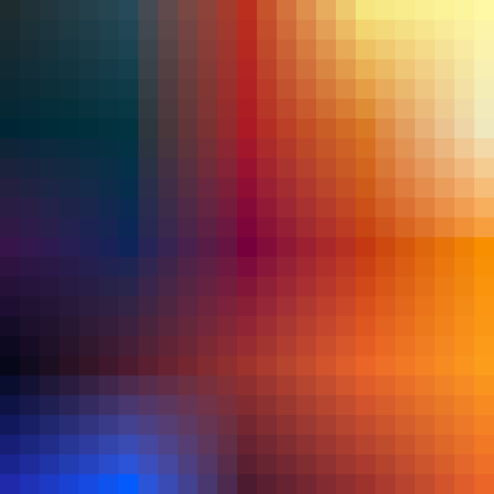

# Palettes

Click any image to go to the source image; the text line above the image to go to the source .hexplt file.

### [`Blue_Fire_augmented_10_grid`](Blue_Fire_augmented_10_grid.hexplt)

### [`Blue_Fire_augmented_1_grid`](Blue_Fire_augmented_1_grid.hexplt)

### [`Blue_Fire_augmented_5_grid`](Blue_Fire_augmented_5_grid.hexplt)

### [`1_blue_fire_1`](1_blue_fire_1.hexplt)

### [`2_blue_fire_2`](2_blue_fire_2.hexplt)

### [`4_blue_fire_3`](4_blue_fire_3.hexplt)

### [`6_Blue_Fire_4`](6_Blue_Fire_4.hexplt)

### [`7_Blue_Fire_5`](7_Blue_Fire_5.hexplt)

Created with [palettesMarkdownGallery.sh](https://github.com/earthbound19/_ebDev/blob/master/scripts/imgAndVideo/palettesMarkdownGallery.sh).