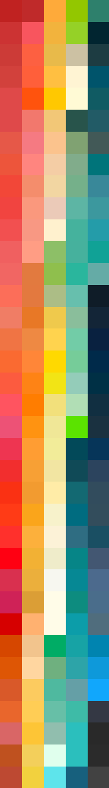

# Palettes

Click any image to go to the source image; the text line above the image to go to the source .hexplt file.

### [`Earthbound_Summers_Augmented-1-grid`](Earthbound_Summers_Augmented-1-grid.hexplt)

### [`Earthbound_Summers_Palettes_Grid`](Earthbound_Summers_Palettes_Grid.hexplt)

### [`Earthbound_Summers_palettesColumnsOklabSortGrid_n8_s000000`](Earthbound_Summers_palettesColumnsOklabSortGrid_n8_s000000.hexplt)

Created with [palettesMarkdownGallery.sh](https://github.com/earthbound19/_ebDev/blob/master/scripts/imgAndVideo/palettesMarkdownGallery.sh).