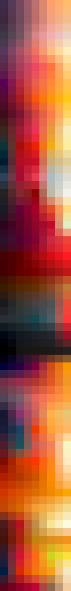
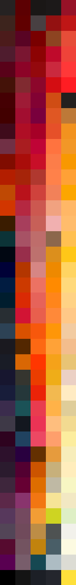

# Palettes

Click any image to go to the source image; the text line above the image to go to the source .hexplt file.

### [`Firebird_Augmented-1-grid`](Firebird_Augmented-1-grid.hexplt)

### [`Firebird_Palettes_Grid`](Firebird_Palettes_Grid.hexplt)

### [`Firebird_palettesColumnsOklabSortGrid_n8_s000000`](Firebird_palettesColumnsOklabSortGrid_n8_s000000.hexplt)

Created with [palettesMarkdownGallery.sh](https://github.com/earthbound19/_ebDev/blob/master/scripts/imgAndVideo/palettesMarkdownGallery.sh).