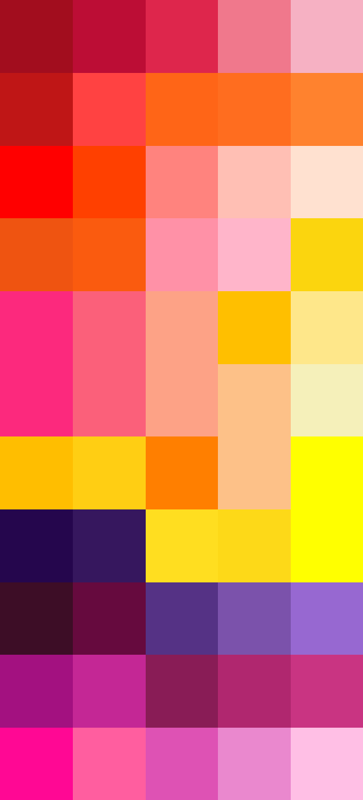

# Palettes

Click any image to go to the source image; the text line above the image to go to the source .hexplt file.

### [`Rose_and_Red_Flowers_augmented_5_grid`](Rose_and_Red_Flowers_augmented_5_grid.hexplt)

### [`Rose_and_Red_Flowers_augmented_5_grid_v2`](Rose_and_Red_Flowers_augmented_5_grid_v2.hexplt)

### [`Rose_and_Red_Flowers_palettesColumnsOklabSortGrid_n8_s000000`](Rose_and_Red_Flowers_palettesColumnsOklabSortGrid_n8_s000000.hexplt)

### [`Rose_and_Red_Flowers_palettes_grid`](Rose_and_Red_Flowers_palettes_grid.hexplt)

Created with [palettesMarkdownGallery.sh](https://github.com/earthbound19/_ebDev/blob/master/scripts/imgAndVideo/palettesMarkdownGallery.sh).