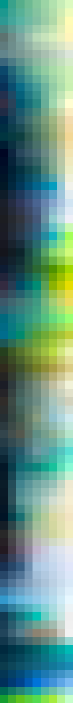

# Palettes

Click any image to go to the source image; the text line above the image to go to the source .hexplt file.

### [`Sky_and_Faded_Jungle_augmented_1_grid`](Sky_and_Faded_Jungle_augmented_1_grid.hexplt)

### [`Sky_and_Faded_Jungle_augmented_1_grid_v2`](Sky_and_Faded_Jungle_augmented_1_grid_v2.hexplt)

### [`Sky_and_Faded_Jungle_palettesColumnsOklabSortGrid_n8_s000000`](Sky_and_Faded_Jungle_palettesColumnsOklabSortGrid_n8_s000000.hexplt)

### [`Sky_and_Faded_Jungle_palettes_grid`](Sky_and_Faded_Jungle_palettes_grid.hexplt)

Created with [palettesMarkdownGallery.sh](https://github.com/earthbound19/_ebDev/blob/master/scripts/imgAndVideo/palettesMarkdownGallery.sh).