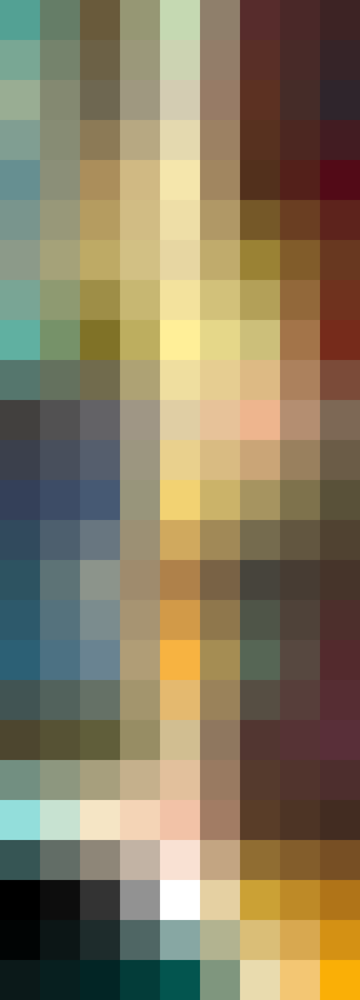
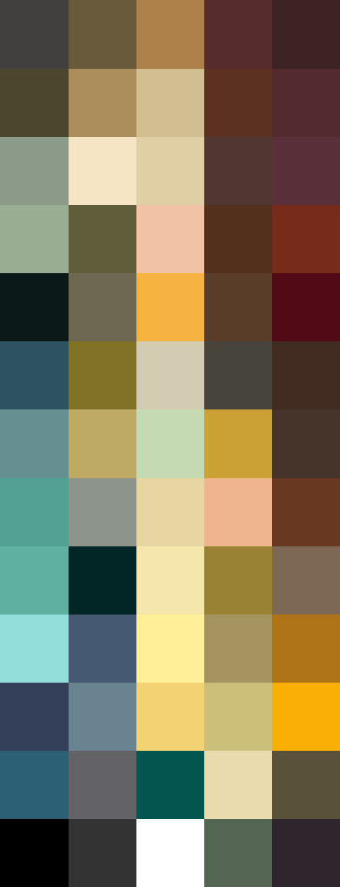

# Palettes

Click any image to go to the source image; the text line above the image to go to the source .hexplt file.

### [`This_is_The_Way_augmented_1_grid`](This_is_The_Way_augmented_1_grid.hexplt)

### [`This_is_The_Way_augmented_2_grid`](This_is_The_Way_augmented_2_grid.hexplt)

### [`This_is_The_Way_palettesColumnsOklabSortGrid_n8_s000000`](This_is_The_Way_palettesColumnsOklabSortGrid_n8_s000000.hexplt)

### [`This_is_The_Way_palettes_grid`](This_is_The_Way_palettes_grid.hexplt)

Created with [palettesMarkdownGallery.sh](https://github.com/earthbound19/_ebDev/blob/master/scripts/imgAndVideo/palettesMarkdownGallery.sh).