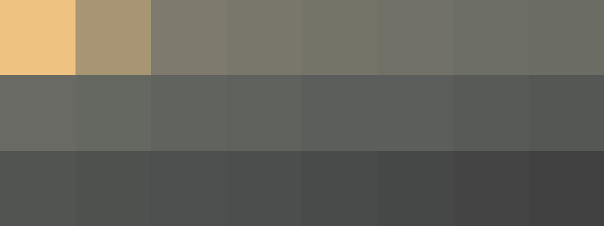
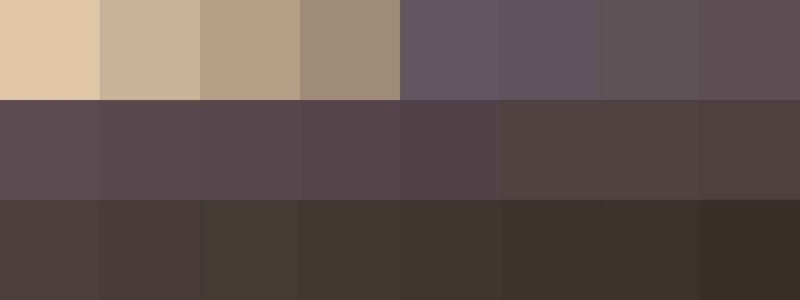

# Palettes

Click any image to go to the source image; the text line above the image to go to the source .hexplt file.

### [`1_CS7ADdgx`](1_CS7ADdgx.hexplt)

### [`2_cXVRn8TH`](2_cXVRn8TH.hexplt)

### [`3_PFFM3XhM`](3_PFFM3XhM.hexplt)

### [`4_U65Q87ZN`](4_U65Q87ZN.hexplt)

### [`5_bHcdnUGt`](5_bHcdnUGt.hexplt)

### [`6_PwCU9KYb`](6_PwCU9KYb.hexplt)

### [`7_cn3ShjhJ`](7_cn3ShjhJ.hexplt)

Created with [palettesMarkdownGallery.sh](https://github.com/earthbound19/_ebDev/blob/master/scripts/imgAndVideo/palettesMarkdownGallery.sh).