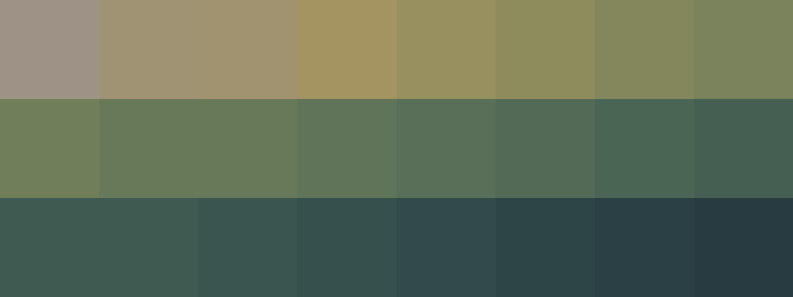

# Palettes

Click any image to go to the source image; the text line above the image to go to the source .hexplt file.

### [`016_24235tpb_palette`](016_24235tpb_palette.hexplt)

### [`017_asrafi2k_palette`](017_asrafi2k_palette.hexplt)

### [`018_8h8fur8k_palette`](018_8h8fur8k_palette.hexplt)

### [`019_av2566ba_palette`](019_av2566ba_palette.hexplt)

### [`020_9p437btr_palette`](020_9p437btr_palette.hexplt)

### [`021_8b3i267i_palette`](021_8b3i267i_palette.hexplt)

Created with [palettesMarkdownGallery.sh](https://github.com/earthbound19/_ebDev/blob/master/scripts/imgAndVideo/palettesMarkdownGallery.sh).