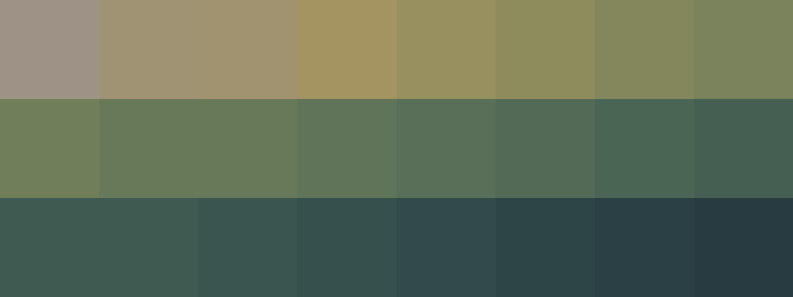

# Palettes

Click any image to go to the source image; the text line above the image to go to the source .hexplt file.

### [`1_GJRhGm6Y`](1_GJRhGm6Y.hexplt)

### [`2_bxTbvrbv`](2_bxTbvrbv.hexplt)

### [`3_yVRycpCt`](3_yVRycpCt.hexplt)

### [`4_PapaBBHX`](4_PapaBBHX.hexplt)

### [`5_SbBkvVXN`](5_SbBkvVXN.hexplt)

### [`6_wfH75NmV`](6_wfH75NmV.hexplt)

### [`7_VBDThPZZ`](7_VBDThPZZ.hexplt)

Created with [palettesMarkdownGallery.sh](https://github.com/earthbound19/_ebDev/blob/master/scripts/imgAndVideo/palettesMarkdownGallery.sh).