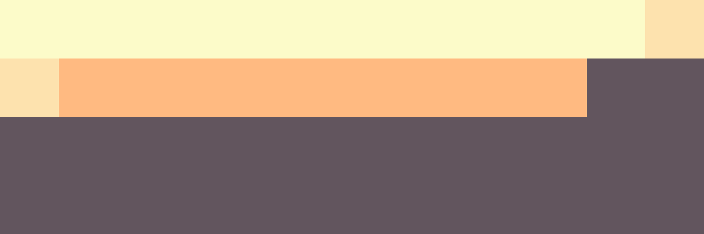

# Palettes

Click any image to go to the source image; the text line above the image to go to the source .hexplt file.

### [`022_a2xsm7iy_palette`](022_a2xsm7iy_palette.hexplt)

### [`023_3jck4tjv_palette`](023_3jck4tjv_palette.hexplt)

### [`024_bq4ic96m_palette`](024_bq4ic96m_palette.hexplt)

### [`025_8d9ifgnj_palette`](025_8d9ifgnj_palette.hexplt)

Created with [palettesMarkdownGallery.sh](https://github.com/earthbound19/_ebDev/blob/master/scripts/imgAndVideo/palettesMarkdownGallery.sh).