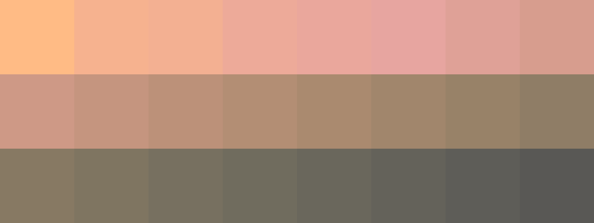
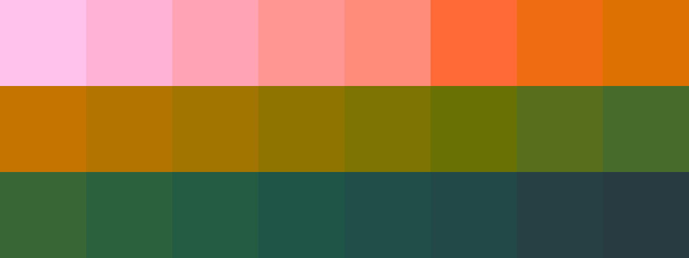

# Palettes

Click any image to go to the source image; the text line above the image to go to the source .hexplt file.

### [`1_GyMGQS2k`](1_GyMGQS2k.hexplt)

### [`2_YdRUwpeJ`](2_YdRUwpeJ.hexplt)

### [`3_PDDGtYjm`](3_PDDGtYjm.hexplt)

### [`4_JDMBTb3u`](4_JDMBTb3u.hexplt)

Created with [palettesMarkdownGallery.sh](https://github.com/earthbound19/_ebDev/blob/master/scripts/imgAndVideo/palettesMarkdownGallery.sh).