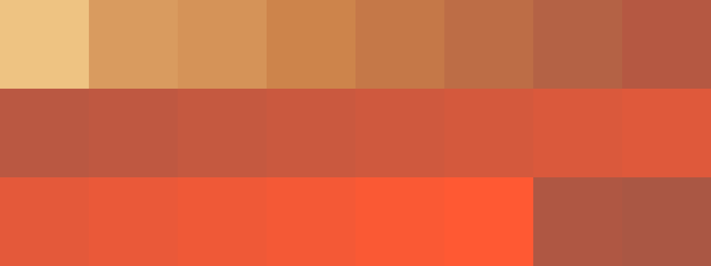

# Palettes

Click any image to go to the source image; the text line above the image to go to the source .hexplt file.

### [`1_Mz4FNbfy`](1_Mz4FNbfy.hexplt)

### [`2_Xr7jYsCQ`](2_Xr7jYsCQ.hexplt)

### [`3_QD957HGu`](3_QD957HGu.hexplt)

### [`4_mCCTSBYU`](4_mCCTSBYU.hexplt)

Created with [palettesMarkdownGallery.sh](https://github.com/earthbound19/_ebDev/blob/master/scripts/imgAndVideo/palettesMarkdownGallery.sh).