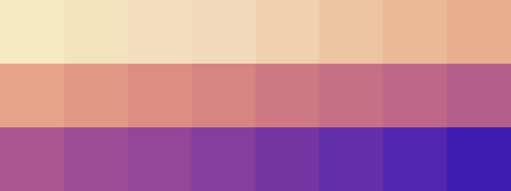

# Palettes

Click any image to go to the source image; the text line above the image to go to the source .hexplt file.

### [`002_94n5smty_palette`](002_94n5smty_palette.hexplt)

### [`003_4zgch9s5_palette`](003_4zgch9s5_palette.hexplt)

### [`004_djdg2ciq_palette`](004_djdg2ciq_palette.hexplt)

Created with [palettesMarkdownGallery.sh](https://github.com/earthbound19/_ebDev/blob/master/scripts/imgAndVideo/palettesMarkdownGallery.sh).