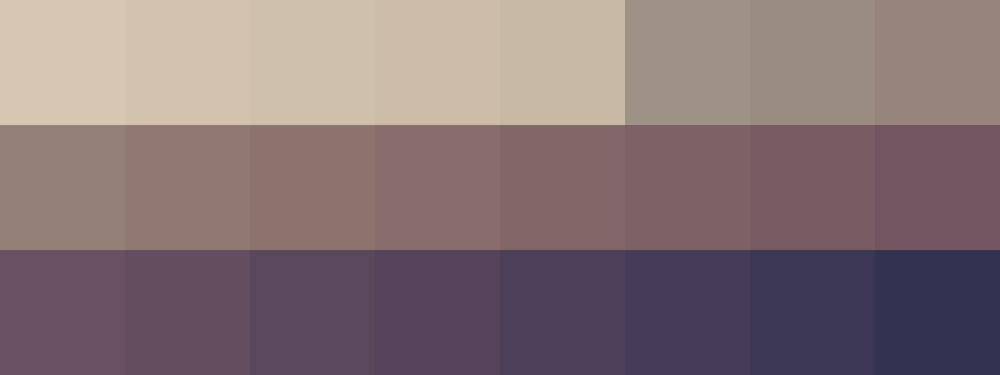

# Palettes

Click any image to go to the source image; the text line above the image to go to the source .hexplt file.

### [`1_rrKUAzkj`](1_rrKUAzkj.hexplt)

### [`2_D7gYgNcj`](2_D7gYgNcj.hexplt)

### [`3_rAgUXbAc`](3_rAgUXbAc.hexplt)

### [`4_EfBDq2ZB`](4_EfBDq2ZB.hexplt)

### [`5_pB7h424c`](5_pB7h424c.hexplt)

Created with [palettesMarkdownGallery.sh](https://github.com/earthbound19/_ebDev/blob/master/scripts/imgAndVideo/palettesMarkdownGallery.sh).