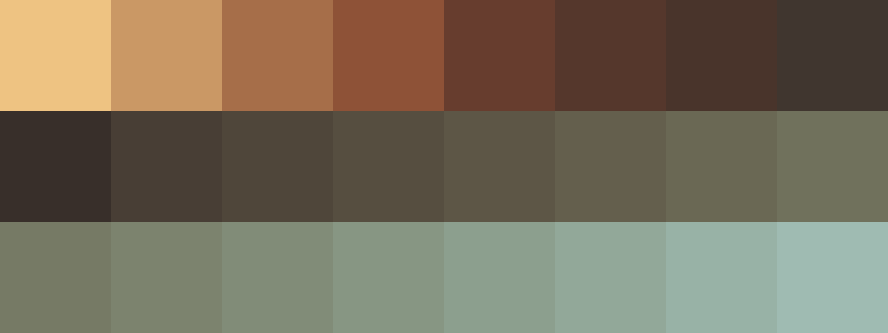

# Palettes

Click any image to go to the source image; the text line above the image to go to the source .hexplt file.

### [`137_bvts9dvz_palette`](137_bvts9dvz_palette.hexplt)

### [`138_bbg38uam_palette`](138_bbg38uam_palette.hexplt)

### [`139_bu6dsbe2_palette`](139_bu6dsbe2_palette.hexplt)

### [`140_bpqxp9rk_palette`](140_bpqxp9rk_palette.hexplt)

### [`141_acrmguuc_palette`](141_acrmguuc_palette.hexplt)

Created with [palettesMarkdownGallery.sh](https://github.com/earthbound19/_ebDev/blob/master/scripts/imgAndVideo/palettesMarkdownGallery.sh).