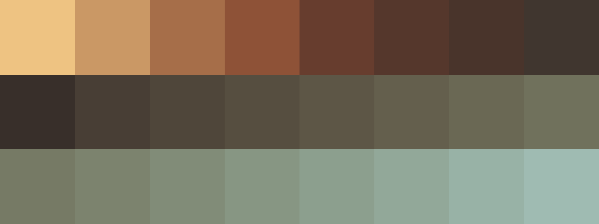

# Palettes

Click any image to go to the source image; the text line above the image to go to the source .hexplt file.

### [`1_FN6nxaqZ`](1_FN6nxaqZ.hexplt)

### [`2_Cpr3PqZ2`](2_Cpr3PqZ2.hexplt)

### [`3_B7AWjhkm`](3_B7AWjhkm.hexplt)

### [`4_RFhk4kNg`](4_RFhk4kNg.hexplt)

### [`5_RrFA56qG`](5_RrFA56qG.hexplt)

Created with [palettesMarkdownGallery.sh](https://github.com/earthbound19/_ebDev/blob/master/scripts/imgAndVideo/palettesMarkdownGallery.sh).