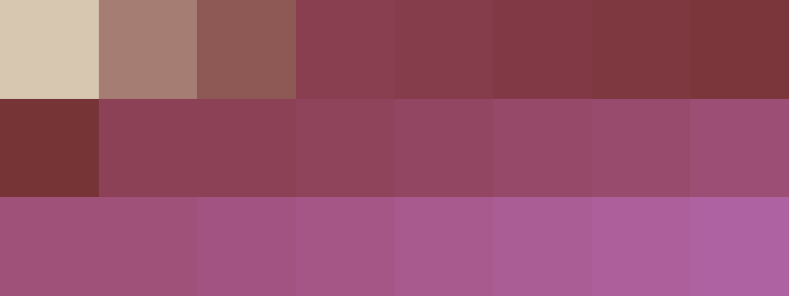

# Palettes

Click any image to go to the source image; the text line above the image to go to the source .hexplt file.

### [`142_8rnubtxu_palette`](142_8rnubtxu_palette.hexplt)

### [`143_4yf9u9e6_palette`](143_4yf9u9e6_palette.hexplt)

### [`144_4u66b5un_palette`](144_4u66b5un_palette.hexplt)

Created with [palettesMarkdownGallery.sh](https://github.com/earthbound19/_ebDev/blob/master/scripts/imgAndVideo/palettesMarkdownGallery.sh).