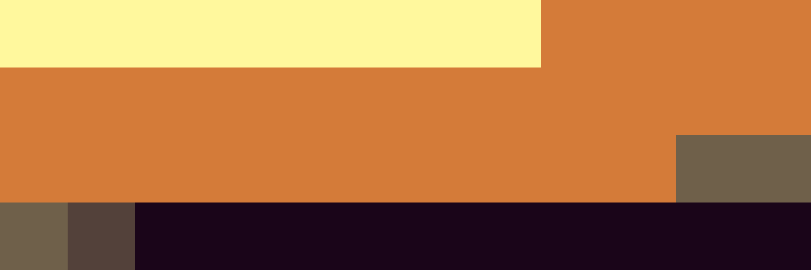

# Palettes

Click any image to go to the source image; the text line above the image to go to the source .hexplt file.

### [`170_8xj3un6h_palette`](170_8xj3un6h_palette.hexplt)

### [`171_7tt7b4xp_palette`](171_7tt7b4xp_palette.hexplt)

### [`172_9jjpwk6v_palette`](172_9jjpwk6v_palette.hexplt)

Created with [palettesMarkdownGallery.sh](https://github.com/earthbound19/_ebDev/blob/master/scripts/imgAndVideo/palettesMarkdownGallery.sh).