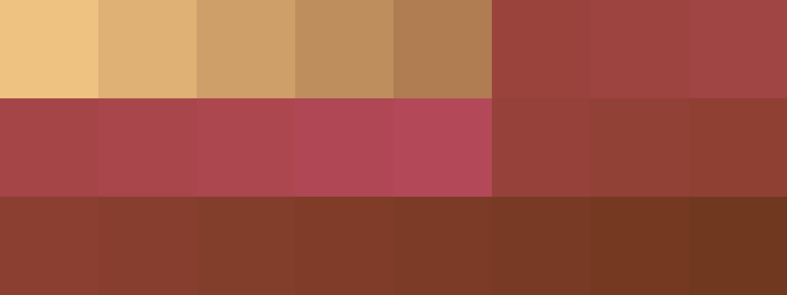
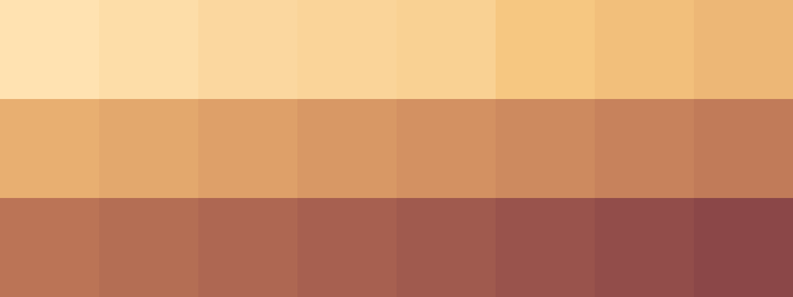

# Palettes

Click any image to go to the source image; the text line above the image to go to the source .hexplt file.

### [`1_dN3VJ99m`](1_dN3VJ99m.hexplt)

### [`2_zVKCzwJC`](2_zVKCzwJC.hexplt)

### [`3_tW4b45GM`](3_tW4b45GM.hexplt)

### [`4_9fe2NqDq`](4_9fe2NqDq.hexplt)

### [`5_rysVEP9Z`](5_rysVEP9Z.hexplt)

Created with [palettesMarkdownGallery.sh](https://github.com/earthbound19/_ebDev/blob/master/scripts/imgAndVideo/palettesMarkdownGallery.sh).