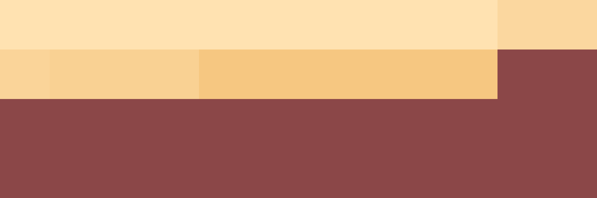

# Palettes

Click any image to go to the source image; the text line above the image to go to the source .hexplt file.

### [`177_69pfi279_palette`](177_69pfi279_palette.hexplt)

### [`178_9igzvbyq_palette`](178_9igzvbyq_palette.hexplt)

### [`179_byzfcwwc_palette`](179_byzfcwwc_palette.hexplt)

### [`180_9rzeddgi_palette`](180_9rzeddgi_palette.hexplt)

### [`181_admx6f6f_palette`](181_admx6f6f_palette.hexplt)

Created with [palettesMarkdownGallery.sh](https://github.com/earthbound19/_ebDev/blob/master/scripts/imgAndVideo/palettesMarkdownGallery.sh).