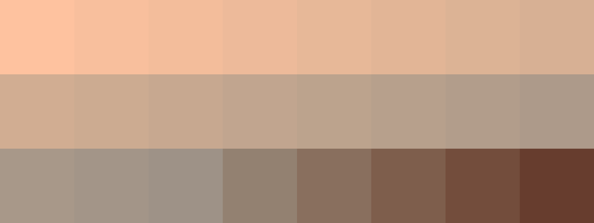
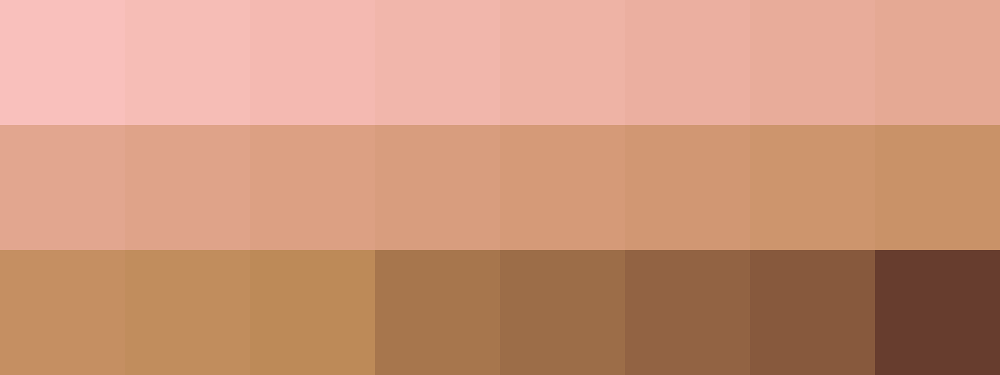
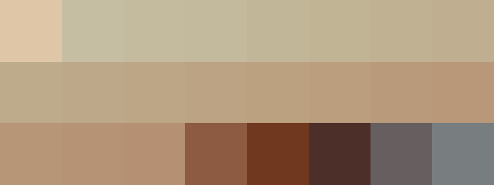
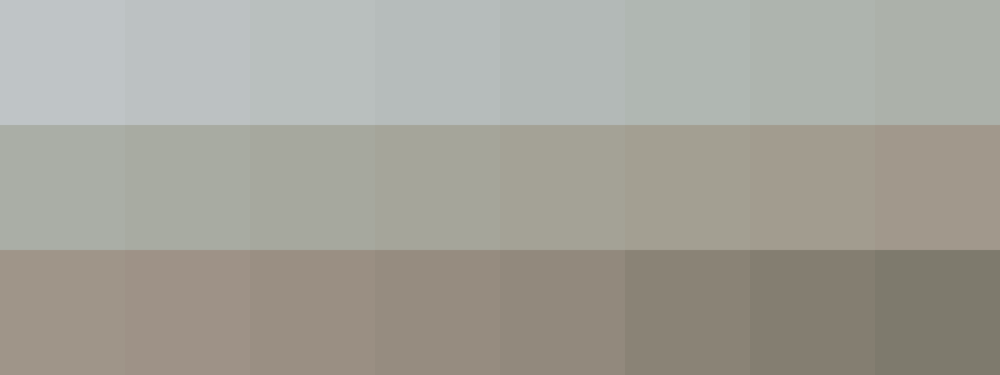

# Palettes

Click any image to go to the source image; the text line above the image to go to the source .hexplt file.

### [`1_ZFtYWhGu`](1_ZFtYWhGu.hexplt)

### [`2_PBsZcjDP`](2_PBsZcjDP.hexplt)

### [`3_JA8ZarFC`](3_JA8ZarFC.hexplt)

### [`4_pG79AtYW`](4_pG79AtYW.hexplt)

### [`5_qbEEHhtN`](5_qbEEHhtN.hexplt)

Created with [palettesMarkdownGallery.sh](https://github.com/earthbound19/_ebDev/blob/master/scripts/imgAndVideo/palettesMarkdownGallery.sh).