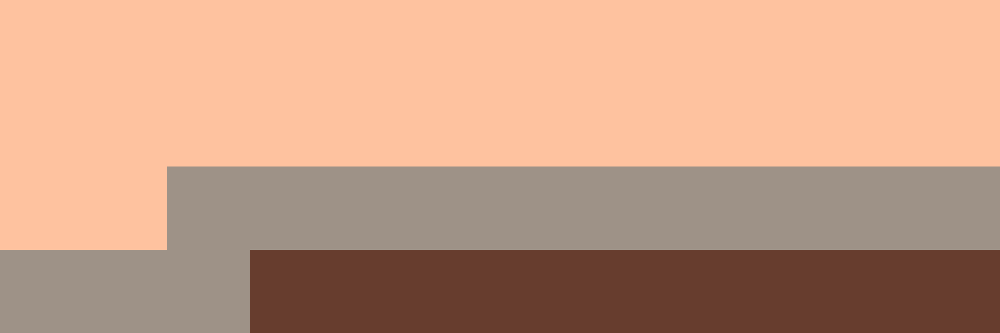
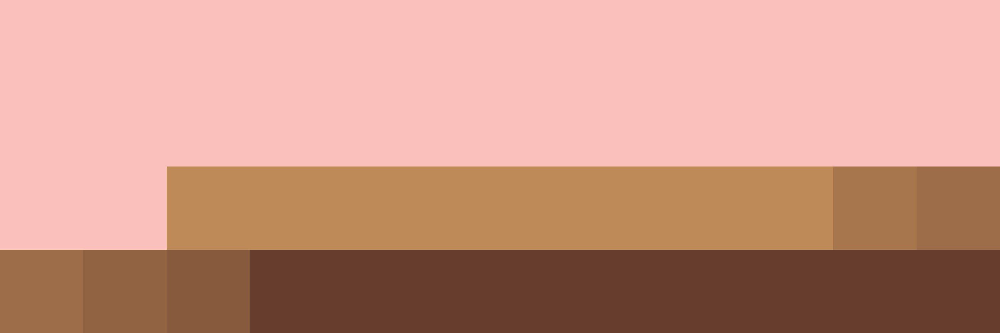
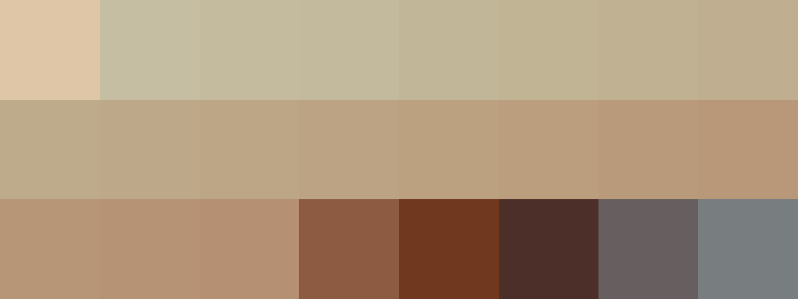

# Palettes

Click any image to go to the source image; the text line above the image to go to the source .hexplt file.

### [`047_97j4hr5i_palette`](047_97j4hr5i_palette.hexplt)

### [`048_9khuyvgh_palette`](048_9khuyvgh_palette.hexplt)

### [`049_7gaezm8w_palette`](049_7gaezm8w_palette.hexplt)

### [`050_4kmwahg4_palette`](050_4kmwahg4_palette.hexplt)

### [`051_3wpdvps8_palette`](051_3wpdvps8_palette.hexplt)

Created with [palettesMarkdownGallery.sh](https://github.com/earthbound19/_ebDev/blob/master/scripts/imgAndVideo/palettesMarkdownGallery.sh).