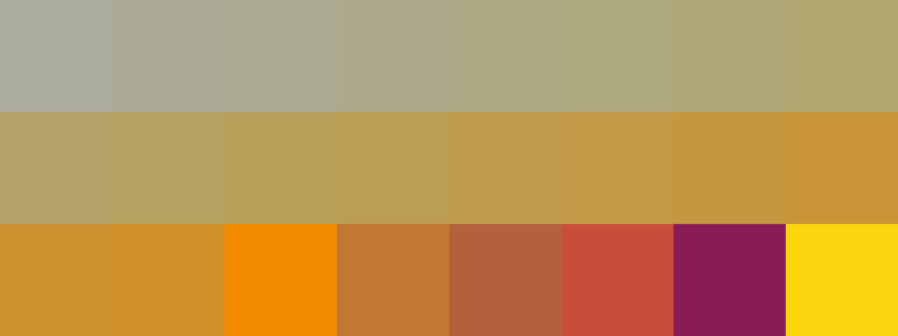

# Palettes

Click any image to go to the source image; the text line above the image to go to the source .hexplt file.

### [`39_2icqegmh`](39_2icqegmh.hexplt)

### [`052_5vritz7g_palette`](052_5vritz7g_palette.hexplt)

### [`053_6qtc93h9_palette`](053_6qtc93h9_palette.hexplt)

Created with [palettesMarkdownGallery.sh](https://github.com/earthbound19/_ebDev/blob/master/scripts/imgAndVideo/palettesMarkdownGallery.sh).