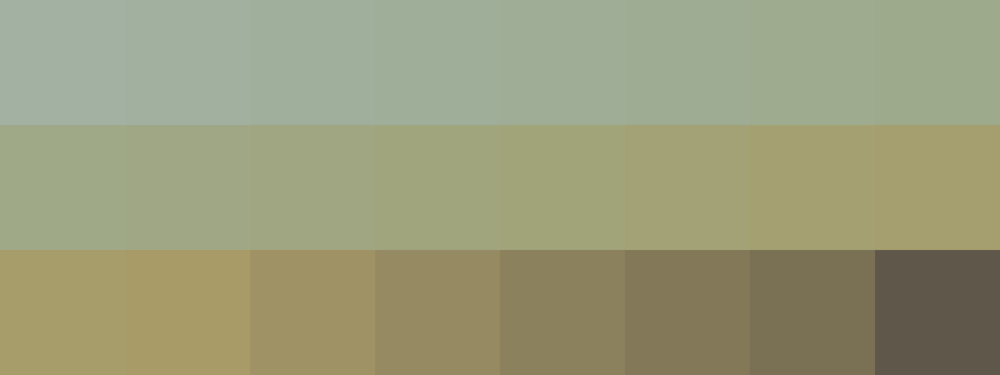

# Palettes

Click any image to go to the source image; the text line above the image to go to the source .hexplt file.

### [`1_4GWDYWpT`](1_4GWDYWpT.hexplt)

### [`2_5Z5Kqd4n`](2_5Z5Kqd4n.hexplt)

### [`3_JcKDHFPz`](3_JcKDHFPz.hexplt)

Created with [palettesMarkdownGallery.sh](https://github.com/earthbound19/_ebDev/blob/master/scripts/imgAndVideo/palettesMarkdownGallery.sh).