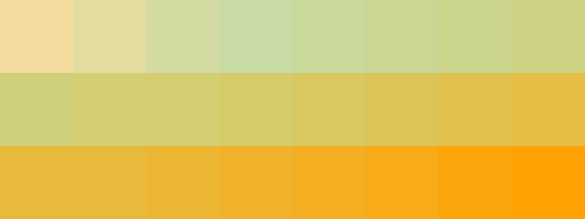

# Palettes

Click any image to go to the source image; the text line above the image to go to the source .hexplt file.

### [`1_j4yA7HXn`](1_j4yA7HXn.hexplt)

### [`2_pYdy2FRV`](2_pYdy2FRV.hexplt)

### [`3_UrYVkPcR`](3_UrYVkPcR.hexplt)

### [`4_m2k5EMfJ`](4_m2k5EMfJ.hexplt)

### [`5_TznGJVhC`](5_TznGJVhC.hexplt)

### [`6_DFRjGrKR`](6_DFRjGrKR.hexplt)

Created with [palettesMarkdownGallery.sh](https://github.com/earthbound19/_ebDev/blob/master/scripts/imgAndVideo/palettesMarkdownGallery.sh).