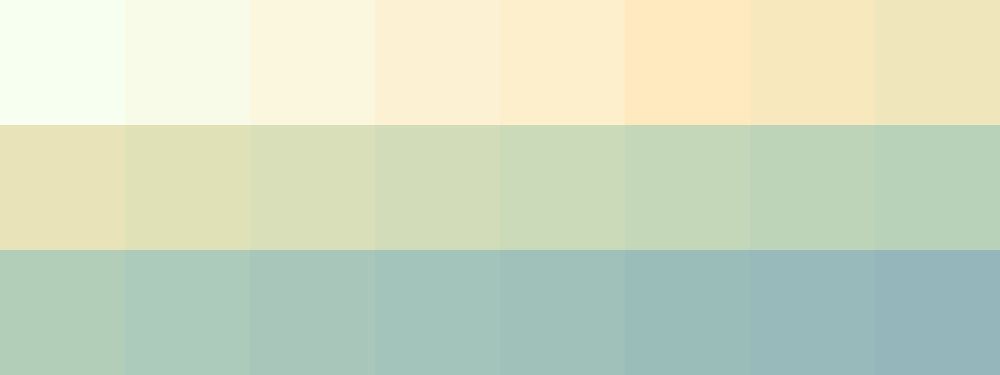

# Palettes

Click any image to go to the source image; the text line above the image to go to the source .hexplt file.

### [`071_2qfqj447_palette`](071_2qfqj447_palette.hexplt)

### [`072_8aa8zf9a_palette`](072_8aa8zf9a_palette.hexplt)

### [`073_3e5hp53t_palette`](073_3e5hp53t_palette.hexplt)

Created with [palettesMarkdownGallery.sh](https://github.com/earthbound19/_ebDev/blob/master/scripts/imgAndVideo/palettesMarkdownGallery.sh).