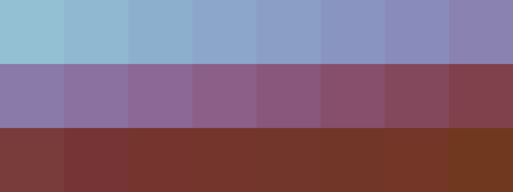
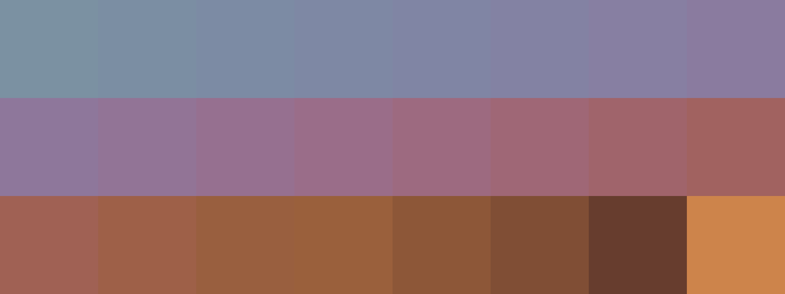

# Palettes

Click any image to go to the source image; the text line above the image to go to the source .hexplt file.

### [`086_3cpux7tw_palette`](086_3cpux7tw_palette.hexplt)

### [`087_7x2s6ajn_palette`](087_7x2s6ajn_palette.hexplt)

### [`089_6ridrrqn_palette`](089_6ridrrqn_palette.hexplt)

Created with [palettesMarkdownGallery.sh](https://github.com/earthbound19/_ebDev/blob/master/scripts/imgAndVideo/palettesMarkdownGallery.sh).