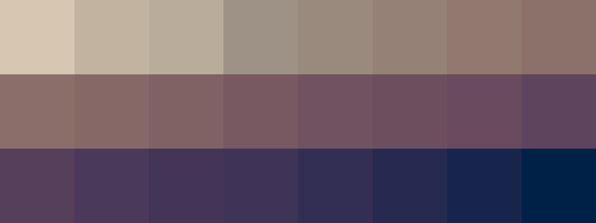

# Palettes

Click any image to go to the source image; the text line above the image to go to the source .hexplt file.

### [`1_P4PAQUS3`](1_P4PAQUS3.hexplt)

### [`2_bepap4dz`](2_bepap4dz.hexplt)

### [`3_ZQMjkUbu`](3_ZQMjkUbu.hexplt)

### [`4_4qrK7QRt`](4_4qrK7QRt.hexplt)

Created with [palettesMarkdownGallery.sh](https://github.com/earthbound19/_ebDev/blob/master/scripts/imgAndVideo/palettesMarkdownGallery.sh).