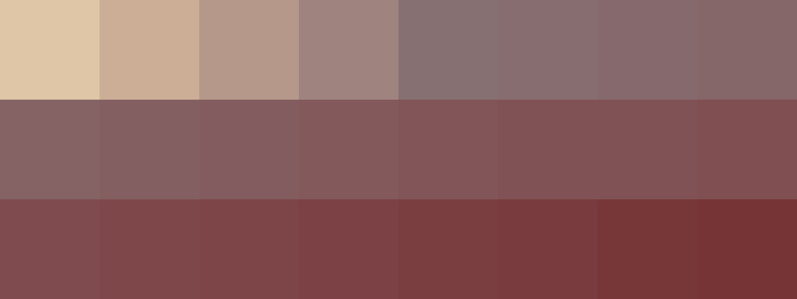
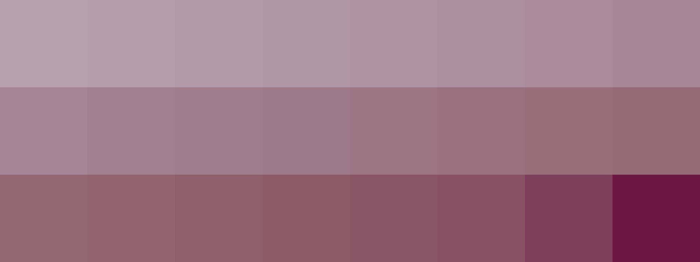

# Palettes

Click any image to go to the source image; the text line above the image to go to the source .hexplt file.

### [`119_5nq7wgz6_palette`](119_5nq7wgz6_palette.hexplt)

### [`120_6whqhbsi_palette`](120_6whqhbsi_palette.hexplt)

### [`122_2i36gpxq_palette`](122_2i36gpxq_palette.hexplt)

Created with [palettesMarkdownGallery.sh](https://github.com/earthbound19/_ebDev/blob/master/scripts/imgAndVideo/palettesMarkdownGallery.sh).