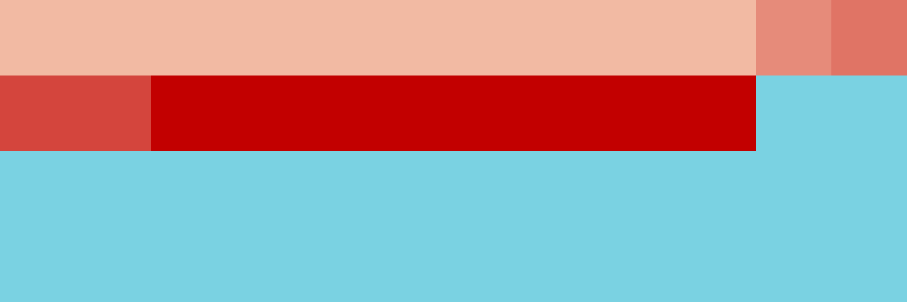

# Palettes

Click any image to go to the source image; the text line above the image to go to the source .hexplt file.

### [`01_auj7f4jp`](01_auj7f4jp.hexplt)

### [`02_jpzwgit7`](02_jpzwgit7.hexplt)

### [`03_feqefnte`](03_feqefnte.hexplt)

### [`04_5dj4i5ie`](04_5dj4i5ie.hexplt)

Created with [palettesMarkdownGallery.sh](https://github.com/earthbound19/_ebDev/blob/master/scripts/imgAndVideo/palettesMarkdownGallery.sh).