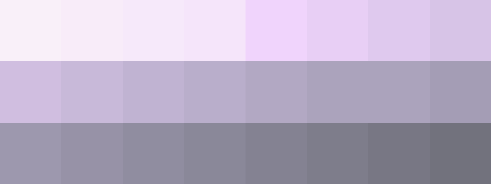

# Palettes

Click any image to go to the source image; the text line above the image to go to the source .hexplt file.

### [`1_x7usmKnY`](1_x7usmKnY.hexplt)

### [`2_VdryGNSA`](2_VdryGNSA.hexplt)

### [`3_E3fxwnNt`](3_E3fxwnNt.hexplt)

Created with [palettesMarkdownGallery.sh](https://github.com/earthbound19/_ebDev/blob/master/scripts/imgAndVideo/palettesMarkdownGallery.sh).