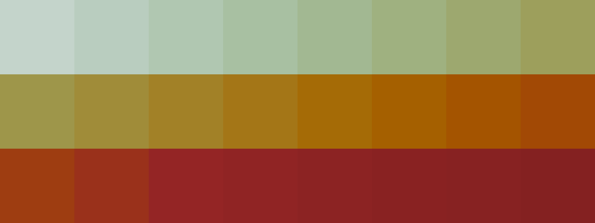

# Palettes

Click any image to go to the source image; the text line above the image to go to the source .hexplt file.

### [`12_m2by23cw`](12_m2by23cw.hexplt)

### [`13_ek7s6jsb`](13_ek7s6jsb.hexplt)

### [`14_gdnxgvbs`](14_gdnxgvbs.hexplt)

### [`15_w5ftym6h`](15_w5ftym6h.hexplt)

Created with [palettesMarkdownGallery.sh](https://github.com/earthbound19/_ebDev/blob/master/scripts/imgAndVideo/palettesMarkdownGallery.sh).