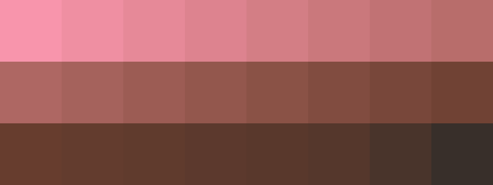

# Palettes

Click any image to go to the source image; the text line above the image to go to the source .hexplt file.

### [`1_ByMJm448`](1_ByMJm448.hexplt)

### [`2_cGmYc2Vm`](2_cGmYc2Vm.hexplt)

### [`3_S3JRMssr`](3_S3JRMssr.hexplt)

### [`4_nbV8Wm8b`](4_nbV8Wm8b.hexplt)

Created with [palettesMarkdownGallery.sh](https://github.com/earthbound19/_ebDev/blob/master/scripts/imgAndVideo/palettesMarkdownGallery.sh).