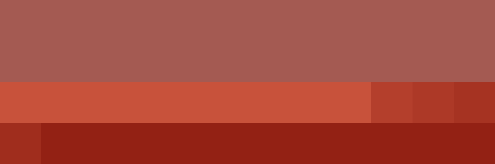

# Palettes

Click any image to go to the source image; the text line above the image to go to the source .hexplt file.

### [`19_q5uvmgqt`](19_q5uvmgqt.hexplt)

### [`20_vkwjq26n`](20_vkwjq26n.hexplt)

Created with [palettesMarkdownGallery.sh](https://github.com/earthbound19/_ebDev/blob/master/scripts/imgAndVideo/palettesMarkdownGallery.sh).