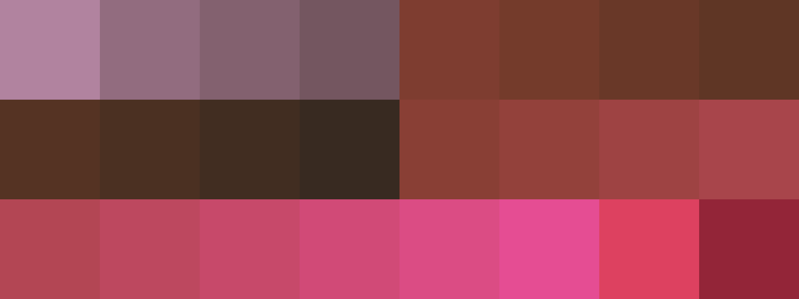

# Palettes

Click any image to go to the source image; the text line above the image to go to the source .hexplt file.

### [`21_vrqvm2wn`](21_vrqvm2wn.hexplt)

Created with [palettesMarkdownGallery.sh](https://github.com/earthbound19/_ebDev/blob/master/scripts/imgAndVideo/palettesMarkdownGallery.sh).