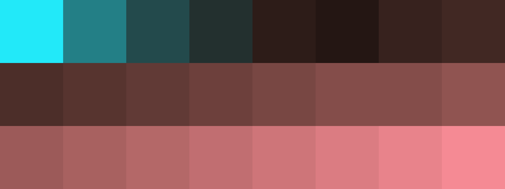

# Palettes

Click any image to go to the source image; the text line above the image to go to the source .hexplt file.

### [`44_ndn7ujhy`](44_ndn7ujhy.hexplt)

### [`45_d82b6zg5`](45_d82b6zg5.hexplt)

Created with [palettesMarkdownGallery.sh](https://github.com/earthbound19/_ebDev/blob/master/scripts/imgAndVideo/palettesMarkdownGallery.sh).