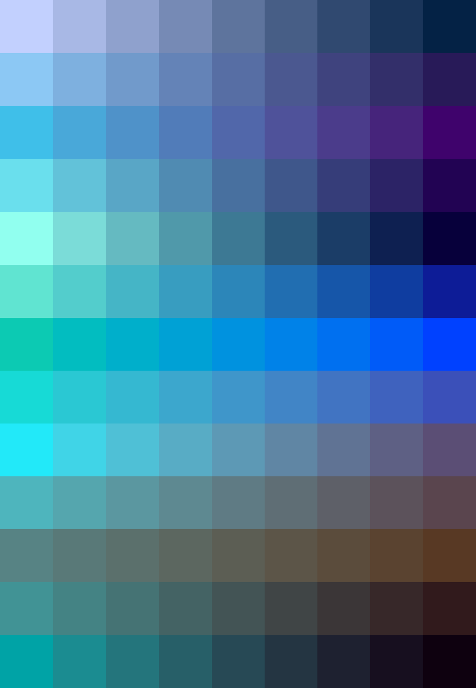

# Palettes

Click any image to go to the source image; the text line above the image to go to the source .hexplt file.

### [`Sploach_Augmented_1x1-grid`](Sploach_Augmented_1x1-grid.hexplt)

### [`Sploach_palettes_grid`](Sploach_palettes_grid.hexplt)

### [`02_Xr486`](02_Xr486.hexplt)

### [`03_Rek5s`](03_Rek5s.hexplt)

### [`06_Jn3xq`](06_Jn3xq.hexplt)

### [`06b_hand_picked_cool`](06b_hand_picked_cool.hexplt)

### [`07_Ni2dj`](07_Ni2dj.hexplt)

### [`10_Z3tud`](10_Z3tud.hexplt)

### [`11_Eh3nr`](11_Eh3nr.hexplt)

Created with [palettesMarkdownGallery.sh](https://github.com/earthbound19/_ebDev/blob/master/scripts/imgAndVideo/palettesMarkdownGallery.sh).