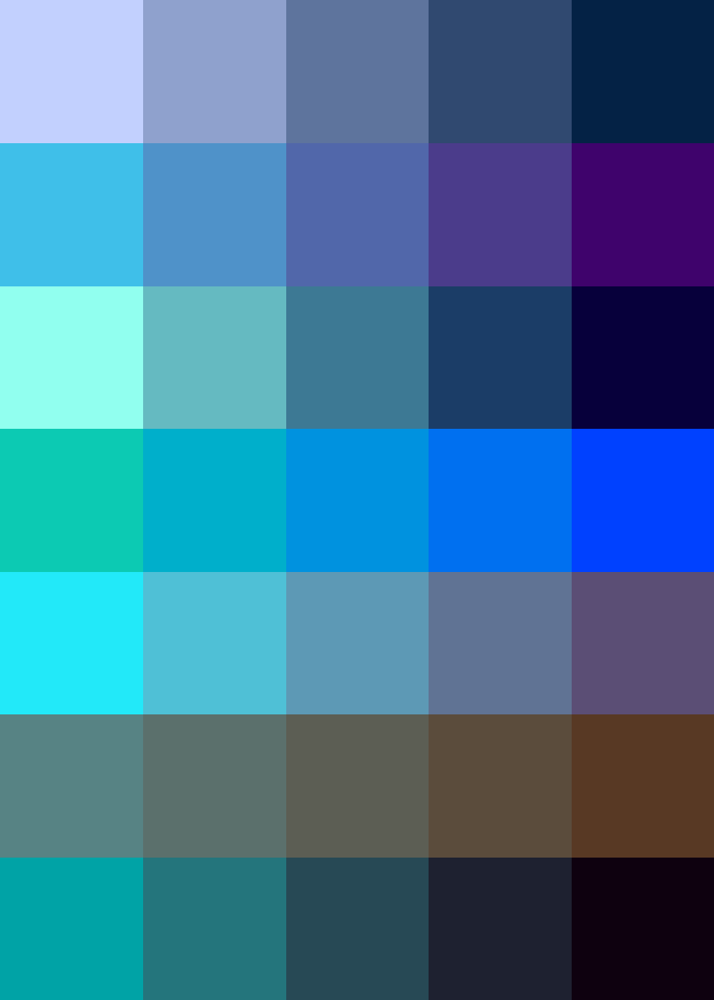

# Palettes

Click any image to go to the source image; the text line above the image to go to the source .hexplt file.

### [`Sploach_augmented_1x1_grid`](Sploach_augmented_1x1_grid.hexplt)

### [`Sploach_palettes_grid`](Sploach_palettes_grid.hexplt)

### [`02_xr486_palette`](02_xr486_palette.hexplt)

### [`03_rek5s_palette`](03_rek5s_palette.hexplt)

### [`06_jn3xq_palette`](06_jn3xq_palette.hexplt)

### [`06b_hand_picked_cool`](06b_hand_picked_cool.hexplt)

### [`07_ni2dj_palette`](07_ni2dj_palette.hexplt)

### [`10_z3tud_palette`](10_z3tud_palette.hexplt)

### [`11_eh3nr_palette`](11_eh3nr_palette.hexplt)

Created with [palettesMarkdownGallery.sh](https://github.com/earthbound19/_ebDev/blob/master/scripts/imgAndVideo/palettesMarkdownGallery.sh).